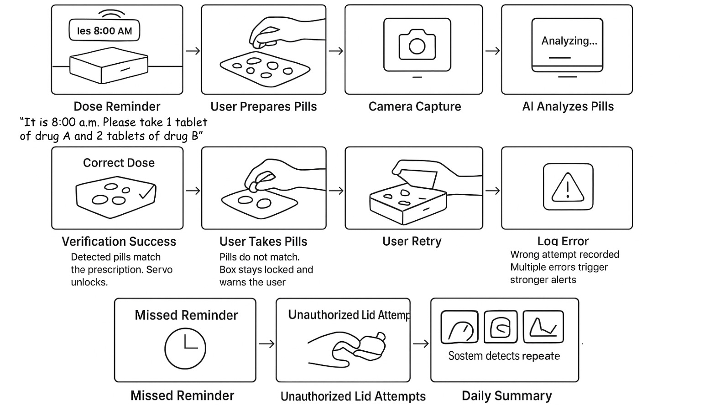

# Pill Checker – Smart Pillbox Verification + Workshop Demo

**Authors:** Wenzhuo Ma - wm356, Haoye Wang - hw867
**Course:** Interactive Device Design (Final Project)

## Demo Video (Full User Flow)

**[Watch the Iteration A Demo Video (Google Drive)](https://drive.google.com/file/d/1AzOt4D0UNu8dvzEidtejADHtNCmdWF-R/view?usp=drive_link)**

---

## Final Deliverables

### 1) Project plan: Big idea, timeline, parts needed, fall-back plan

The project plan is documented in `Final_Proposal.md`. The following content is copied from that document, with a short “current implementation” note at the end when the plan differs from what we shipped.

#### Big idea (from `Final_Proposal.md`)

In this project we design a smart medication box that tries to prevent real-world pill mistake, especially for people who take many drugs every day.

The core idea is: the user can only take the pills **after** our system verifies the **whole current dose** (all pills for this time) using computer vision.

At each scheduled dose time:

- The device uses speaker to tell the user what they should take now, for example:  
  “It is 8:00 AM. Please take 1 tablet of Drug A and 2 tablets of Drug B.”
- User puts all pills for this dose on a white **Verification Pad**.
- A 720p camera takes a photo; AI vision detects each pill type and count.
- If the detected recipe exactly matches the prescription for this time, servo unlocks and user can access pills.
- Otherwise the box stays locked, LED and speaker give warning, and we log the wrong attempt.

Besides pill verification, the system also has basic time control and logging: it knows when you should take medicine, reminds you, records if you miss the window, and warns if you keep opening the lid without actually taking a verified dose.

#### Timeline (from `Final_Proposal.md`)

- **Week 1: Hardware and Box** – assemble Pi, camera, servo, LED, speaker, MPR121, verification pad; test physical fit.
- **Week 2: Sensors, Servo and Camera Integration** – read sensors, control lock states, capture 720p images.
- **Week 3: AI Vision and Dose Logic** – integrate vision and implement recipe comparison (YES/NO decision).
- **Week 4: Time Logic and UX** – add schedule/time windows, LED rules, voice prompts, event logging.
- **Week 5: Testing, Video and Documentation** – execute testing plan, record demo, finalize documentation.

#### Parts needed (plan vs shipped)

- **Planned in proposal**: verification pad, optional servo lock, OLED/LCD, etc. (see `Final_Proposal.md`)
- **Shipped / implemented in this repo**:
  - Raspberry Pi + camera (720p capture)
  - MPR121 touch sensor (lid state)
  - SparkFun Qwiic Button (explicit “capture now” trigger)
  - RGB LED (status feedback)
  - Speaker + `espeak` (voice prompts)
  - Ollama + `moondream:latest` (structured pill color counting)

#### Fall-back plan (aligned with this repo)

If the AI vision part is not reliable enough (e.g., lighting / confusing pills / runtime instability), we fall back to a simpler guided mode:

- Keep time-window reminders and safety warnings
- Keep capture + logging for later review
- For workshop conditions, use `smart_pillbox_demo_mock_ai.py` as a fallback: real photos are captured, but counts are manually entered so the interaction can still be demonstrated reliably

---

### 2) Functioning project: an interactive device/system

#### What the system is (overview)

Pill Checker is an integrated smart pillbox prototype that combines:

- **Touch sensing (MPR121)** to detect lid state (open/closed)
- **A physical trigger button (SparkFun Qwiic Button)** to confirm “take a photo now”
- **Camera capture (OpenCV)** at 1280×720
- **Local vision analysis (Ollama + `moondream:latest`)** that returns structured JSON pill color counts
- **Multimodal feedback** via **RGB LED** patterns and **voice prompts** (`espeak` preferred)

We intentionally maintain **two versions**:

- **Iteration A (full user flow)**: `smart_pillbox.py`  
  Lid state + button trigger + camera capture + Ollama JSON parsing + prescription comparison + LED/voice feedback.
- **Iteration B (stable workshop demo)**: `smart_pillbox_demo.py` (**already presented in the workshop**)  
  Workshop-friendly flow that focuses on “colors + counts + daily totals” for immediate comprehension.

`smart_pillbox_demo_mock_ai.py` is **not the primary demo**; it is a **fallback** when the environment is not favorable for Ollama (network/model latency, lighting, etc.). It still captures real images but asks the operator to type counts manually.

#### Hardware (as implemented)

- **Raspberry Pi (Pi 4/5 recommended)**
- **Camera** (USB webcam or Pi Camera), top-down view
- **SparkFun Qwiic Button** (I2C)
- **MPR121 capacitive touch sensor** (I2C)
- **RGB LED** (GPIO **21/20/26**, PWM via `gpiozero`)
- **Speaker** (for voice prompts via `espeak`)

##### Wiring notes (text-only)

- **I2C bus**: SDA/SCL + 3V3 + GND shared by Qwiic Button and MPR121  
- **RGB LED pins (BCM)**:
  - **Red** → GPIO 21
  - **Green** → GPIO 20
  - **Blue** → GPIO 26

#### Software requirements

- Python 3
- `espeak` (recommended)
- Ollama + `moondream:latest` (required for Iteration B demo and AI counting)

#### Quick Start

##### 1) Setup Python env

```bash
cd ~/Interactive-Lab-Hub/Final
python3 -m venv .venv
source .venv/bin/activate
python -m pip install --upgrade pip
python -m pip install -r requirements.txt
```

##### 2) Install system dependencies (voice + I2C tooling)

```bash
sudo apt-get update
sudo apt-get install -y espeak i2c-tools
```

##### 3) Start Ollama (for AI vision)

```bash
curl -fsSL https://ollama.com/install.sh | sh
ollama pull moondream:latest
ollama serve
```

##### 4) Configure camera / endpoint (optional)

Edit `pillbox_config.json`:

- `camera.index`, `camera.width/height`, warm-up parameters
- `vision.endpoint` (default: `http://localhost:11434/api/generate`)
- `vision.timeout` (seconds)

##### 5) Run

- **Iteration A (full user flow)**:

```bash
python3 smart_pillbox.py
```

- **How to interact (Iteration A)**
  - Step 1: enter prescription targets (color + count) in the terminal
  - Step 2: open the lid (touch sensor changes state)
  - Step 3: press the Qwiic button to capture an image
  - Step 4: Ollama returns JSON pill color counts
  - Step 5: the system compares detected counts vs prescription:
    - match → voice confirms + green success
    - mismatch → warning + red alert/failure

- **Time window rule (Iteration A)**: the default allowed window in `smart_pillbox.py` is **08:00–12:00**. Opening outside the window triggers warnings.

- **Iteration B (stable workshop demo)**:

```bash
python3 smart_pillbox_demo.py
```

- **How it behaves (Iteration B)**:
  - “This time you took X red / Y blue / Z green”
  - “Today in total you have taken …”
  - Status: already presented in the workshop

---

### 3) Documentation of design process

We documented our process as a progression from isolated bring-up tests → integrated user flow → workshop-focused iteration.

#### Storyboard



#### Enclosure / Appearance Design

This section documents the **industrial design** decisions and the physical enclosure layout.

- **Back view (charger / power design, fully enclosed)**: the charging solution is integrated so that no charger is exposed outside.


- **Inside view (with pill placement area)**


- **Inside view (without pill placement area)**


#### Pre-flight / bring-up tests (what we built first)

We started by validating each module independently to avoid compounding failures during integration:

- **Bring-up / component tests** (`tests/`): LED patterns, voice prompts, camera framing, I2C connectivity, time-window reminders

##### Bring-up checklist (scripts)

Run these in order to isolate hardware issues early.

- **Test 0 – Check I2C devices**:

```bash
sudo i2cdetect -y 1
```

- **Test 1 – LEDAnimator wiring sanity**:

```bash
python3 tests/test_green_idle_led.py
```

- **Test 2 – Success feedback (LED + voice)**:

```bash
python3 tests/led_success_test.py
```

- **Test 3 – Warning feedback (LED + voice)**:

```bash
python3 tests/led_warning_test.py
```

- **Test 4 – Fast framing probe (button → photo only)**:

```bash
python3 tests/button_capture_probe.py
```

This probe is useful **before** running the full Ollama pipeline: it helps you quickly confirm the camera framing/placement is correct (pill area in view, focus/lighting OK) without introducing AI/model variables.

- **Test 5 – Simulate opening outside the time window**:

```bash
python3 tests/test_open_outside_window.py
```

- **Test 6 – Simulate noon reminder (missed dose)**:

```bash
python3 tests/test_noon_reminder_voice.py
```

#### Iteration A → Iteration B (what changed and why)

- **Integration (Iteration A)**: connect lid state + capture trigger + AI counting + validation + feedback into one complete flow.
- **Workshop iteration (Iteration B)**: simplify the interaction for limited in-class time while keeping the same capture + AI pipeline.

##### Peer review (Iteration A)

- **Dean Xu**: “This is a really impressive end-to-end flow. The button-triggered capture makes the interaction explicit, and the LED + voice feedback is very clear. I’d love to use something like this in real life.”
- **Classmate (anonymous)**: “The system feels complete as a user flow. The warning case is easy to understand, and the JSON logging makes it feel like a serious prototype rather than a toy demo.”

##### Peer review (Iteration B)

- **Classmate (anonymous)**: “This demo is perfect for workshop pacing. In under 10 seconds I understood what it does because it immediately speaks the color counts.”
- **Classmate (anonymous)**: “The daily total makes the behavior obvious and memorable. It’s easy to explain without diving into schedule logic.”

---

### 4) Archive (code + assets + patterns to rebuild from scratch)

Everything needed to recreate the project is included in this folder:

- **Code**: `smart_pillbox.py`, `smart_pillbox_demo.py`, `smart_pillbox_demo_mock_ai.py`
- **Config**: `pillbox_config.json`
- **Dependencies**: `requirements.txt`
- **Bring-up tests**: `tests/`
- **Captured dataset / logs**: `pillbox_images/` (photos + raw Ollama + parsed JSON)
- **Design materials**: `img/` (storyboard + enclosure photos)

#### Repository Map

- **Core**
  - `smart_pillbox.py` – core implementation (`ButtonCameraTester`)
  - `smart_pillbox_demo.py` – workshop demo (stable) built on the same pipeline
  - `smart_pillbox_demo_mock_ai.py` – fallback demo if Ollama is unreliable
- **Config / deps**
  - `pillbox_config.json`
  - `requirements.txt`
- **Bring-up tests**
  - `tests/test_green_idle_led.py` – LEDAnimator wiring sanity check
  - `tests/led_success_test.py` – success light + voice test
  - `tests/led_warning_test.py` – warning light + voice test
  - `tests/button_capture_probe.py` – fastest “button → photo” framing probe
  - `tests/test_open_outside_window.py` – simulate opening outside the allowed time window
  - `tests/test_noon_reminder_voice.py` – simulate missed-dose reminder at noon
- **Captured artifacts**
  - `pillbox_images/` – `.jpg` + parsed `.json` + raw `.ollama_raw.txt`

#### Captured outputs (`pillbox_images/`)

Each capture may produce:

- `button_capture_*.jpg` – the photo
- `button_capture_*.ollama_raw.txt` – raw Ollama response (debug)
- `button_capture_*.json` – parsed structured output used by the system

##### Example captures (real files in this repo)

<p float="left">
  
  
</p>

##### Example parsed JSON

```json
{
  "pills": [
    { "color": "white", "count": 1 },
    { "color": "red", "count": 1 }
  ],
  "image_path": "/home/pi/Interactive-Lab-Hub/Final/pillbox_images/button_capture_20251204_151431.jpg",
  "model": "moondream:latest",
  "timestamp": "2025-12-04T15:06:53"
}
```

#### Troubleshooting

- **Ollama request fails**
  - Make sure `ollama serve` is running
  - Check `pillbox_config.json` → `vision.endpoint`
- **Camera cannot open**
  - Try `camera.index = 0/1`
  - Run `tests/button_capture_probe.py` to isolate camera issues
- **Dark or blurry images**
  - Increase `warmup_seconds` / `warmup_frames` in `pillbox_config.json`
  - Improve lighting / use a white background pad
- **Button not detected**
  - Run `sudo i2cdetect -y 1`
  - Re-seat Qwiic cable and confirm power/ground
- **LED colors look wrong**
  - Confirm wiring matches GPIO 21/20/26
  - Verify common-anode vs common-cathode LED behavior

---

### 5) Video of someone using the project

- [User test video(Google Drive)](https://drive.google.com/file/d/19C83XTmPfmUSvJGmkHZHVhJmlEPwLQbx/view?usp=drive_link)

 
