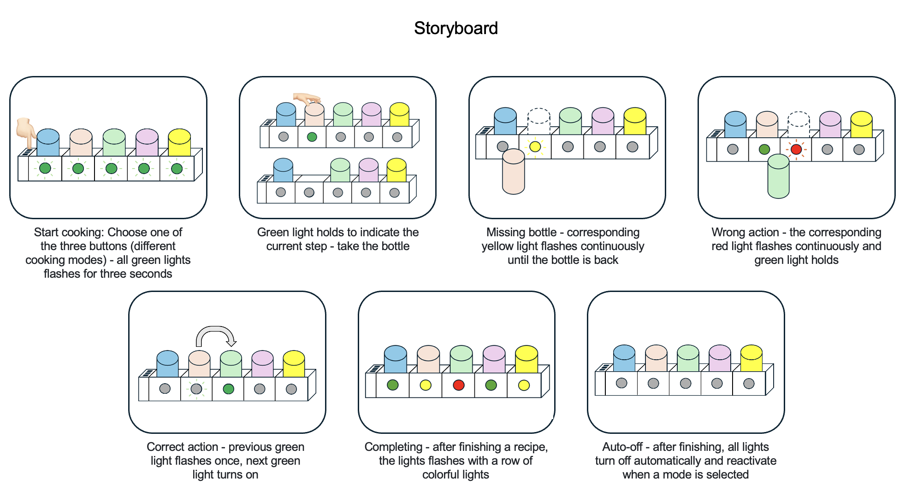

# Staging Interaction

\*\***Collaborator: Wenzhuo Ma**\*\*

### The Report

## Lab Overview
For this assignment, you are going to:

A) [Plan](#part-a-plan) 

B) [Act out the interaction](#part-b-act-out-the-interaction) 

C) [Prototype the device](#part-c-prototype-the-device)

D) [Wizard the device](#part-d-wizard-the-device) 

E) [Costume the device](#part-e-costume-the-device)

F) [Record the interaction](#part-f-record)

Labs are due on Mondays. Make sure this page is linked to on your main class hub page.

## Part 1A. Plan 

\*\***Describe your setting, players, activity and goals here.**\*\*
_Setting:_ Kitchen
_Players:_ The person who is cooking
_Activity:_ Before cooking, choose the mode you would like to cook on the left side of the box. As the cooking process progresses, the green light illuminate in sequence to indicate the current step. The lights guide the chef through the recipe, with the next step indicated by a green light. The bottles represent different condiments (can be in various containers). If a bottle is not returned after use, the yellow light flashes as a warning. Picking the wrong bottle causes the red light to flash. Each time a bottle is correctly picked up and returned, the green light flashes once. Completing all steps triggers all the lights to flash with a colorful lights. In the end, it turned off automatically.
_Goals:_ Help chefs avoid missing or forgetting steps by visualizing cooking progress through interactive lights. Provide immediate feedback on actions to ensure accuracy and proper sequencing.

\*\***Include pictures of your storyboards here**\*\*

\*\***Summarize feedback you got here.**\*\*
We were working on the design during class time so we couldn’t ask for feedback from our peers. We only shared our idea with TA and received positive comments from him.

## Part 1B. Act out the Interaction

\*\***Are there things that seemed better on paper than acted out?**\*\*
Since Tinkerbelle doesn't have multiple lights, we imitated the flashing lights using different background colors on the phone. However, it was difficult to create a flashing effect.

\*\***Are there new ideas that occur to you or your collaborator that come up from the acting?**\*\*
Sound effect: Acting out the sequence made us consider adding subtle auditory signals (chimes) in addition to lights, to provide multi-sensory feedback for the chef.

## Part 1C. Prototype the device

\*\***Give us feedback on Tinkerbelle.**\*\*
Tinkerbelle is a really good software for one light, but it cannot make different lights in different parts of the screen (Partition display). As we do not have five phones to do this lab, we choose slides instead to display the effects.

## Part 1D. Wizard the device
\*\***Include your first attempts at recording the set-up video here.**\*\*

\*\***Show the follow-up work here.**\*\*

We initially used a mobile phone as the display device for the slides to immitate the lights. The slides also include virtual bottles on the phone, which moved alongside the real-world bottle. However, we found this unclear due to the small screen size of the phone, and the movement of the virtual and real bottles together would cause confusions. Therefore, we used a laptop as the display device, deleting the virtual bottles and interact directly with the real bottles. This approach was very clear and achieved all the desired effects.

## Part E. Costume the device

Only now should you start worrying about what the device should look like. Develop three costumes so that you can use your phone as this device.

Think about the setting of the device: is the environment a place where the device could overheat? Is water a danger? Does it need to have bright colors in an emergency setting?

\*\***Include sketches of what your devices might look like here.**\*\*

\*\***What concerns or opportunitities are influencing the way you've designed the device to look?**\*\*

## Part F. Record

\*\***Take a video of your prototyped interaction.**\*\*

\*\***Please indicate who you collaborated with on this Lab.**\*\*
Wenzhuo Ma

# Staging Interaction, Part 2 

This describes the second week's work for this lab activity.

## Prep (to be done before Lab on Wednesday)

You will be assigned three partners from other groups. Go to their github pages, view their videos, and provide them with reactions, suggestions & feedback: explain to them what you saw happening in their video. Guess the scene and the goals of the character. Ask them about anything that wasn’t clear. 

\*\***Summarize feedback from your partners here.**\*\*

## Make it your own

Do last week’s assignment again, but this time: 
1) It doesn’t have to (just) use light, 
2) You can use any modality (e.g., vibration, sound) to prototype the behaviors! Again, be creative! Feel free to fork and modify the tinkerbell code! 
3) We will be grading with an emphasis on creativity. 

\*\***Document everything here. (Particularly, we would like to see the storyboard and video, although photos of the prototype are also great.)**\*\*
