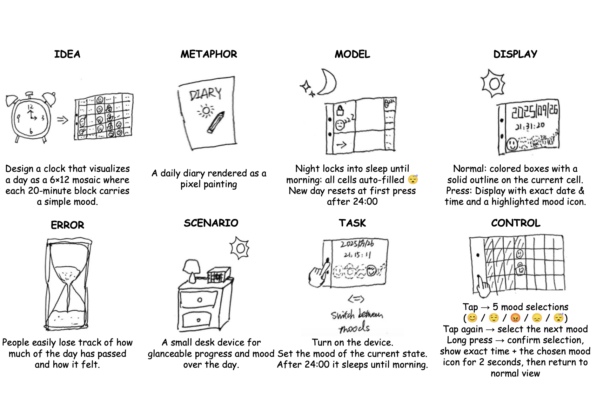

# Interactive Prototyping: The Clock of Pi
###Collaborator: Wenzhuo Ma (wm356)###

## Prep

1. ### Set up your Lab 2 Github

**📖 [Follow the step-by-step guide for safely updating your fork](pull_updates/README.md)**

2. ### Get Kit and Inventory Parts
***Update your [parts list inventory](partslist.md)***

3. ### Prepare your Pi for lab this week
[Follow these instructions](prep.md) to download and burn the image for your Raspberry Pi before lab Thursday.


## Overview

A) [Connect to your Pi](#part-a)  

B) [Try out cli_clock.py](#part-b) 

C) [Set up your RGB display](#part-c)

D) [Try out clock_display_demo](#part-d) 

E) [Modify the code to make the display your own](#part-e)

F) [Make a short video of your modified barebones PiClock](#part-f)

G) [Sketch and brainstorm further interactions and features you would like for your clock for Part 2.](#part-g)

## The Report

## Part A. 
### Connect to your Pi
```
ssh pi@<your Pi's IP address>
pi@raspberrypi:~ $ python -m venv venv
pi@raspberrypi:~ $ source venv/bin/activate
(venv) pi@raspberrypi:~ $ 
```
## Part B. 
### Try out the Command Line Clock
```
(venv) pi@raspberrypi:~$ git clone https://github.com/<YOURGITID>/Interactive-Lab-Hub.git
(venv) pi@raspberrypi:~$ cd Interactive-Lab-Hub/Lab\ 2/
```

## Part C. 
### Testing your Screen
For the following steps stop the service by typing ``` sudo systemctl stop piscreen.service --now```. Othwerise two scripts will try to use the screen at once. You may start it again by typing ``` sudo systemctl start piscreen.service --now```
```
(venv) pi@raspberrypi:~/Interactive-Lab-Hub/Lab 2 $ python screen_test.py
(venv) pi@raspberrypi:~/Interactive-Lab-Hub/Lab 2 $ cat screen_test.py
```
#### Displaying Info with Texts
`screen_boot_script.py`
#### Displaying an image
`image.py`

## Part D. 
### Set up the Display Clock Demo
Work on `screen_clock.py`
You can use the code in `cli_clock.py` and `stats.py` to figure this out.
```
(venv) pi@raspberrypi:~/Interactive-Lab-Hub/Lab 2 $ nano screen_clock.py
```


## Part E. Now moved to Lab2 Part 2.

## Part F. Now moved to Lab2 Part 2.

## Part G. 
## Sketch and brainstorm further interactions and features you would like for your clock for Part 2.


# Prep for Part 2

**Comments from Peers**:

"Your design demonstrates a fresh and creative approach, showing that you were able to expand ideas thoughtfully and explore the design space with originality. The technical execution is solid and well-developed, with the demonstration clearly illustrating the concept’s functionality and value. In addition, your documentation is very clear and well-structured, making the process and outcomes easy to follow and understand. The only area for further improvement is the user testing, where adding more detailed feedback and your own reflections would make the overall work even stronger and more convincing."          
———Sirui Wang

"I recently came across a psychology idea that struck me: instead of the common belief that emotions shape our state, it’s actually the other way around—our state comes first, and emotions follow. The challenge is that when we look back on our recent states, it’s often hard to recall the details, which makes it difficult to understand what caused the fluctuations or how to adjust. With this mood clock, I can build the habit of recording my emotional state in the moment. That way, it becomes much easier to diagnose and fine-tune my state whenever I need to."     
———Dean Xu


# Lab 2 Part 2

## Assignment that was formerly Lab 2 Part E.




## Assignment that was formerly Part F. 
[https://github.com/username/repo/blob/main/path/to/Clock.py#L15](https://github.com/whyooooo/Interactive-Lab-Hub/blob/Fall2025/Lab%202/Clock_update.py)

Video demo for Mood-Clock:
https://drive.google.com/file/d/1t8lyXKFmJtMIb6hGLuXT6Yq2rZ1A9PkL/view?usp=sharing

