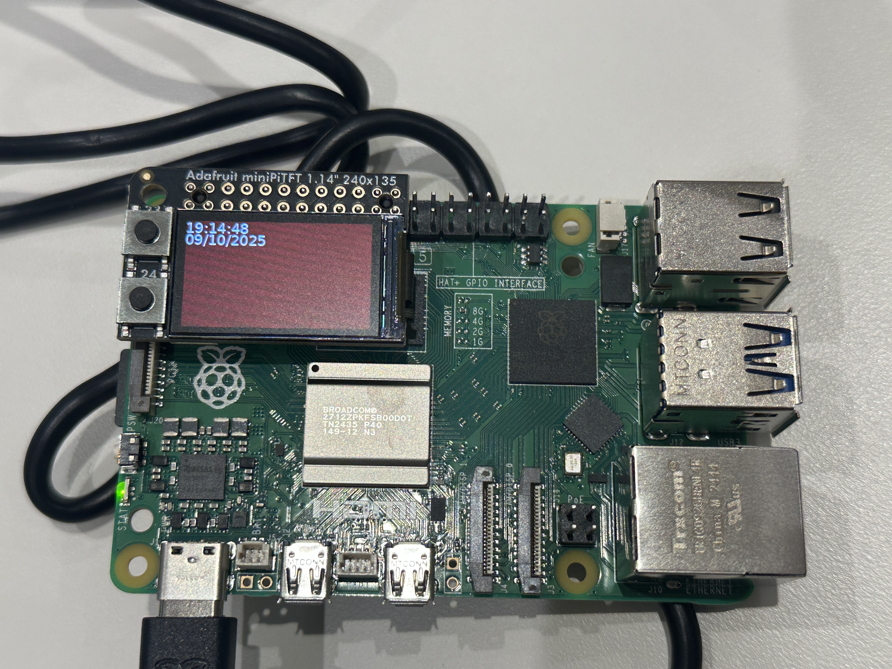
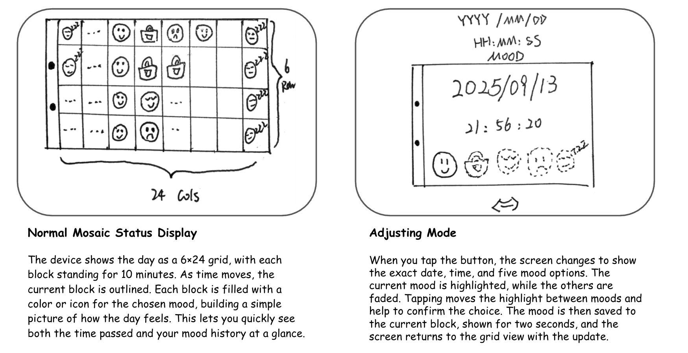

# Interactive Prototyping: The Clock of Pi
###Collaborator: Wenzhuo Ma###

## Prep

1. ### Set up your Lab 2 Github

**📖 [Follow the step-by-step guide for safely updating your fork](pull_updates/README.md)**

2. ### Get Kit and Inventory Parts
***Update your [parts list inventory](partslist.md)***

3. ### Prepare your Pi for lab this week
[Follow these instructions](prep.md) to download and burn the image for your Raspberry Pi before lab Thursday.


## Overview

A) [Connect to your Pi](#part-a)  

B) [Try out cli_clock.py](#part-b) 

C) [Set up your RGB display](#part-c)

D) [Try out clock_display_demo](#part-d) 

E) [Modify the code to make the display your own](#part-e)

F) [Make a short video of your modified barebones PiClock](#part-f)

G) [Sketch and brainstorm further interactions and features you would like for your clock for Part 2.](#part-g)

## The Report

## Part A. 
### Connect to your Pi
```
ssh pi@<your Pi's IP address>
pi@raspberrypi:~ $ python -m venv venv
pi@raspberrypi:~ $ source venv/bin/activate
(venv) pi@raspberrypi:~ $ 
```
## Part B. 
### Try out the Command Line Clock
```
(venv) pi@raspberrypi:~$ git clone https://github.com/<YOURGITID>/Interactive-Lab-Hub.git
(venv) pi@raspberrypi:~$ cd Interactive-Lab-Hub/Lab\ 2/
```

## Part C. 
### Testing your Screen
For the following steps stop the service by typing ``` sudo systemctl stop piscreen.service --now```. Othwerise two scripts will try to use the screen at once. You may start it again by typing ``` sudo systemctl start piscreen.service --now```
```
(venv) pi@raspberrypi:~/Interactive-Lab-Hub/Lab 2 $ python screen_test.py
(venv) pi@raspberrypi:~/Interactive-Lab-Hub/Lab 2 $ cat screen_test.py
```
#### Displaying Info with Texts
`screen_boot_script.py`
#### Displaying an image
`image.py`

## Part D. 
### Set up the Display Clock Demo
Work on `screen_clock.py`
You can use the code in `cli_clock.py` and `stats.py` to figure this out.
```
(venv) pi@raspberrypi:~/Interactive-Lab-Hub/Lab 2 $ nano screen_clock.py
```


## Part E. Now moved to Lab2 Part 2.

## Part F. Now moved to Lab2 Part 2.

## Part G. 
## Sketch and brainstorm further interactions and features you would like for your clock for Part 2.



# Prep for Part 2

## Feedback


# Lab 2 Part 2

## Assignment that was formerly Lab 2 Part E.
### Modify the barebones clock to make it your own


## Assignment that was formerly Part F. 
## Make a short video of your modified barebones PiClock

\*\*\***Take a video of your PiClock.**\*\*\*

After you edit and work on the scripts for Lab 2, the files should be upload back to your own GitHub repo! You can push to your personal github repo by adding the files here, commiting and pushing.

```
(venv) pi@raspberrypi:~/Interactive-Lab-Hub/Lab 2 $ git add .
(venv) pi@raspberrypi:~/Interactive-Lab-Hub/Lab 2 $ git commit -m 'your commit message here'
(venv) pi@raspberrypi:~/Interactive-Lab-Hub/Lab 2 $ git push
```

After that, Git will ask you to login to your GitHub account to push the updates online, you will be asked to provide your GitHub user name and password. Remember to use the "Personal Access Tokens" you set up in Part A as the password instead of your account one! Go on your GitHub repo with your laptop, you should be able to see the updated files from your Pi!


[Update your Lab Hub](pull_updates/README.md) to get the latest content and requirements for Part 2.

Modify the code from last week's lab to make a new visual interface for your new clock. You may [extend the Pi](Extending%20the%20Pi.md) by adding sensors or buttons, but this is not required.

As always, make sure you document contributions and ideas from others explicitly in your writeup.

You are permitted (but not required) to work in groups and share a turn in; you are expected to make equal contribution on any group work you do, and N people's group project should look like N times the work of a single person's lab. What each person did should be explicitly documented. Make sure the page for the group turn in is linked to your Interactive Lab Hub page. 


