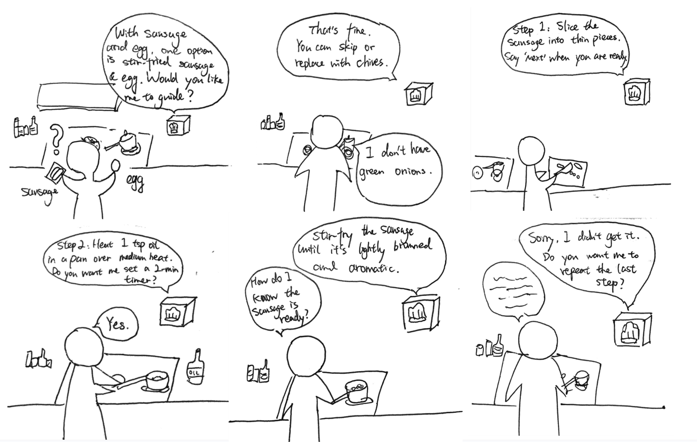
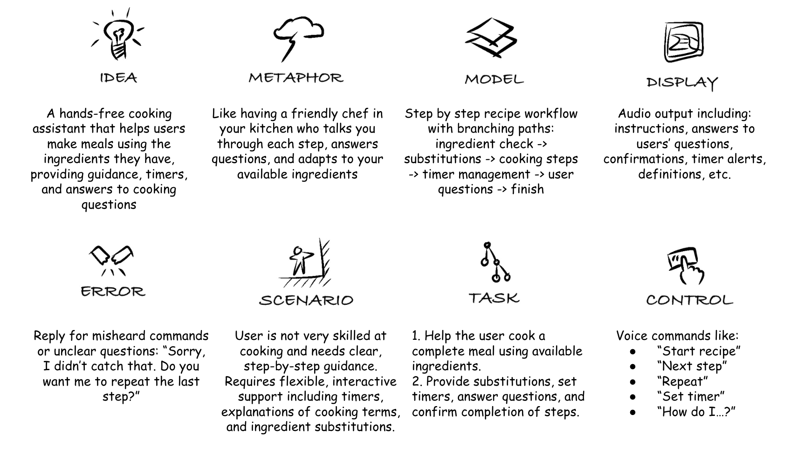
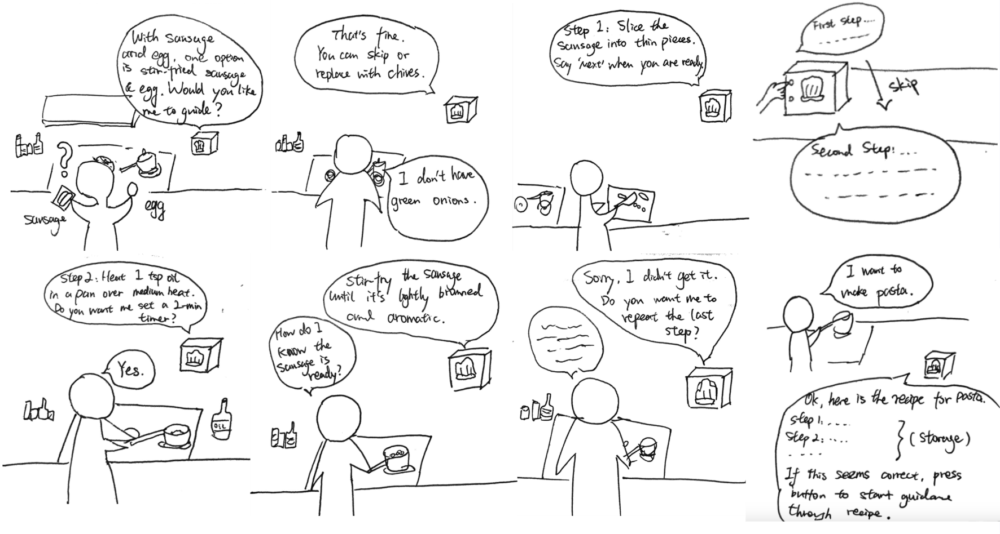

# Chatterboxes
###Collaborator: Wenzhuo Ma (wm356)###

## Part 1.
### Text to Speech 
\*\***Write your own shell file to use your favorite of these TTS engines to have your Pi greet you by name.**\*\*

Please find my shell file [here](https://github.com/whyooooo/Interactive-Lab-Hub/blob/Fall2025/Lab%203/greet_by_name.sh).

### Speech to Text

\*\***Write your own shell file that verbally asks for a numerical based input (such as a phone number, zipcode, number of pets, etc) and records the answer the respondent provides.**\*\*

Please find my shell file [here](https://github.com/whyooooo/Interactive-Lab-Hub/blob/Fall2025/Lab%203/ask_number.sh).

Test commands by running:
```bash
./ask_number.sh
```

The script will:
1. Ask "Please tell me your number" using text-to-speech
2. Record 5 seconds of audio input
3. Process the speech using Vosk offline recognition
4. Save the result to `recorded_number.txt`
5. Play back the recognized number using text-to-speech

### 🤖 NEW: AI-Powered Conversations with Ollama

\*\***Try creating a simple voice interaction that combines speech recognition, Ollama processing, and text-to-speech output. Document what you built and how users responded to it.**\*\*

Please find my voice AI assistant script [here](https://github.com/whyooooo/Interactive-Lab-Hub/blob/Fall2025/Lab%203/voice_ai_assistant.py).

Test commands by running:
```bash
python3 voice_ai_assistant.py
```

The script combines:
1. **Real-time speech recognition** using Vosk 
2. **AI processing** using Ollama API  
3. **Text-to-speech output** using Festival

Features:
- Real-time voice input with live transcription feedback
- AI-powered responses using Ollama phi3:mini model
- Voice output using Festival TTS
- Conversation logging to `conversation_log.txt`
- Say "exit" to quit the conversation

**User Response Documentation:**
The voice AI assistant provides a natural conversational experience. All interactions are logged to [conversation_log.txt](conversation_log.txt) with timestamps for easy review and analysis.

### Storyboard



### Verplank Diagram



\*\***Please describe and document your process.**\*\*

Our Recipe Coach is a voice based cooking assistant designed to make the kitchen experience easier and more convenient. It guides users step by step through recipes, offering clear instructions. Beyond these, it provides flexible support such as setting timers, suggesting ingredient substitutions, clarifying cooking terms, and giving reminders when needed. This hands-free interaction is especially helpful for beginner chefs who may feel overwhelmed in the kitchen, allowing them to focus on cooking without worrying about missing a step. The Recipe Coach adapts to the user’s needs, making home cooking both accessible and enjoyable.

### Acting out the dialogue

Here is the link to the video: https://drive.google.com/file/d/1kZfaJgTYqRgGHBQihvGuF6pen10cT4rR/view?usp=sharing

\*\***Describe if the dialogue seemed different than what you imagined when it was acted out, and how.**\*\*

When acted out, the dialogue felt more natural and conversational than simple exchanges between questions and answers. The pauses, confirmations, and follow-up questions made it more engaging and showed how helpful our design is during cooking.

\*\***Feedback**\*\*

"Having a "teacher" I can consult at any time while cooking is a great solution for my pain points. I usually need to watch the tutorial or recipe several times before cooking, but there are still details I forget or need to confirm during the cooking process. However, during these times, I'm often busy controlling the heat, and my hands are always greasy and dirty, making them unsuitable for using a phone. Having a voice assistant that allows me to free my hands is great."
——Dean Xu

"You guys did a good job! The dialogue is just the same as how I expected which I will have with the intelligent machine. The scenario is good enough to use the AI coach chef. I really like it! And the acting is nice as well!"
——Richard Li

### Wizarding with the Pi (optional)
\*\***Describe if the dialogue seemed different than what you imagined, or when acted out, when it was wizarded, and how.**\*\*

Our device simply rely on audio instructions, so using wizarding techniques isn't strictly necessary for our design.

## Lab 3 Part 2

## Prep for Part 2

Improvements:

a. Wording / Language

- Keep instructions short, direct, and quantitatively precise

- Instead of: “Carefully prepare the dry ingredients by measuring them with precision before mixing.”

- Use: “Measure 200 g all-purpose flour, 50 g sugar, and 2 g salt. Mix them in a large stainless-steel bowl for 30 seconds until evenly combined.”
  
- Focus on converting vague instructions into specific, measurable actions: include exact quantities (grams, milliliters), temperature targets (°C/°F), tools or equipment (e.g., whisk, mixer, pan type), and observable conditions (e.g., “until golden brown,” “until dough forms a smooth ball”).

b. Button / Tap Interaction

- Confirm recipe steps at the beginning

- Users select and confirm the recipe before starting. This reduces confusion later in the process.

- Skip step (only via button, not speech)

- Prevents accidental skips from misheard voice commands.



## Prototype your system

 [Interactive Cooking Assistant](./cooking_assistant.py) (Raspberry Pi + Vosk + tinyllama/Ollama)

 [cooking_assistant.py](./cooking_assistant.py)

## What it is
A voice-first cooking guide that runs on Raspberry Pi. It uses:

- **Sensors:** your mic (audio input sensor) + optional **GPIO button** on **GPIO23** as a physical controller.  
- **Speech:** listens with **Vosk**, speaks with **espeak**, reasons with **tinyllama** via **local Ollama** (no cloud).

---
## Quick Start
```
# 1) System deps
sudo apt update
sudo apt install -y python3-pip espeak

# 2) Python deps
pip3 install vosk sounddevice requests adafruit-blinka

# 3) (Optional) DigitalIO support for the button
pip3 install adafruit-circuitpython-digitalio

# 4) Ollama (local LLM runtime) + tinyllama
curl -fsSL https://ollama.com/install.sh | sh
ollama pull tinyllama
ollama serve  # keep running in a terminal

# 5) Verify Ollama is up (should list `tinyllama`)
curl http://localhost:11434/api/tags

# 6) Run the assistant (in a new terminal)
python3 cooking_assistant.py

```

## How to Use

### 1) Tell it your ingredients + goal
- Say one sentence, e.g., “I have chicken, onions, garlic; I want something quick.”
- If it didn’t catch you, speak clearly near the mic and try again.

### 2) Pick a dish from suggestions
- It will read **3–4 dish names**: say **the name** or **a number** (e.g., “two” or “the second one”).
- If it misheard, restate the dish name.

### 3) Confirm to start
- Say **“yes”**, **“ok”**, or **“ready.”**  
- It will switch to **step-by-step** mode.

### 4) Advance steps (controller)
- **With button (GPIO23):** press and release to go to the **next step**.
- After each step is spoken, you can either **ask a question** or **press again** to continue.

### 5) Ask questions anytime
- Examples: “How finely should I chop the onions?” / “What heat level?”
- It answers briefly, then reminds you to press the button or continue.

### 6) Finish
- After the last step, **press the button once more** to complete.
- Say **“exit”** at any time to quit.


## Test the system
**Demo Video (Must Watch)** (Increase the volume when watching)

You can watch the  [**Demo Video**](https://drive.google.com/file/d/15Dc6L-n8PIi3LA8wX3G2NgVQAjvs3cX8/view?usp=drive_link):
[https://drive.google.com/file/d/15Dc6L-n8PIi3LA8wX3G2NgVQAjvs3cX8/view?usp=drive_link](https://drive.google.com/file/d/15Dc6L-n8PIi3LA8wX3G2NgVQAjvs3cX8/view?usp=drive_link)

**Demo Log**

You can view the **[cooking_conversation_log.txt](./cooking_conversation_log.txt)** and **[cooking_assistant.log](./cooking_assistant.log)** to see system runtime messages, including Ollama responses, user speech inputs, and button interactions.

**Feedback**

"The prototype looks really impressive! It perfectly addresses the hands-free need I mentioned before, and the real-time guidance feels smooth and practical. From a technical perspective, the speech recognition and state management are remarkably stable — the transition between user input, processing, and feedback feels seamless, which shows solid system design and robust integration."

——Dean Xu

"This is a really creative and useful idea. I like how it lets you cook step by step instead of dumping all the instructions at once. The question and answer feature makes it feel more interactive and practical. However, the voice was hard to understand at times, which made following along a bit difficult."

——Jessie Chen


### What worked well about the system and what didn't?

The system performed very well in understanding and responding to user commands. The speech recognition accurately captured most spoken inputs, and the AI responses from Ollama were detailed and contextually relevant. The system was able to handle user questions like "How long should I cook this?" or "What heat level should I use?" effectively, which made the prototype experience quite realistic and helpful.

However, there were a few limitations. The audio output in the demo video was relatively low, making it slightly difficult to hear the prototype's voice clearly. Additionally, while the recognition worked well in quiet environments, it could struggle in noisy kitchen conditions with background sounds like chopping or boiling water. The system also needs to be used in a relatively quiet environment for optimal performance. Interestingly, Ollama occasionally showed humorous or unpredictable behavior — for example, it once mentioned that it "doesn’t like cabbage" for no apparent reason, which highlights some quirks in model personality or response randomness.

### What worked well about the controller and what didn't?

The physical button (GPIO23) worked reliably and provided a simple, intuitive way to control progress through recipe steps. It successfully allowed users to advance steps, confirm actions, or end the session, which reduced the chance of misheard voice commands and made the experience smoother. However, the system only relies on a single button, which could be confusing for first-time users to remember what each press does. It might be beneficial to add audio or visual feedback such as a light to blink when the button is pressed to confirm an action. In future iterations, additional physical controls like buttons for "repeat" or "pause" could make the interface more flexible.

### What lessons can you take away from the WoZ interactions for designing a more autonomous version of the system?

From the Wizard of Oz interactions, we learned that natural conversation and contextual understanding are key to user satisfaction. Users appreciated when the assistant understood follow up questions to clarified recipe details. These interactions highlighted the need for dialogue management, where the system maintains memory of the current recipe step and adapts responses accordingly.


### How could you use your system to create a dataset of interaction? What other sensing modalities would make sense to capture?

The system could easily be adapted to log multimodal interaction data for further improvement. Each cooking session can be recorded in a structured dataset containing: 1. Speech transcripts 2. Timestamps for each exchange 3. Button press events 4. Recipe progress states 5. Error logs. These logs could form a valuable dataset for training better conversational and timing models and used specifically to kitchen environments.


