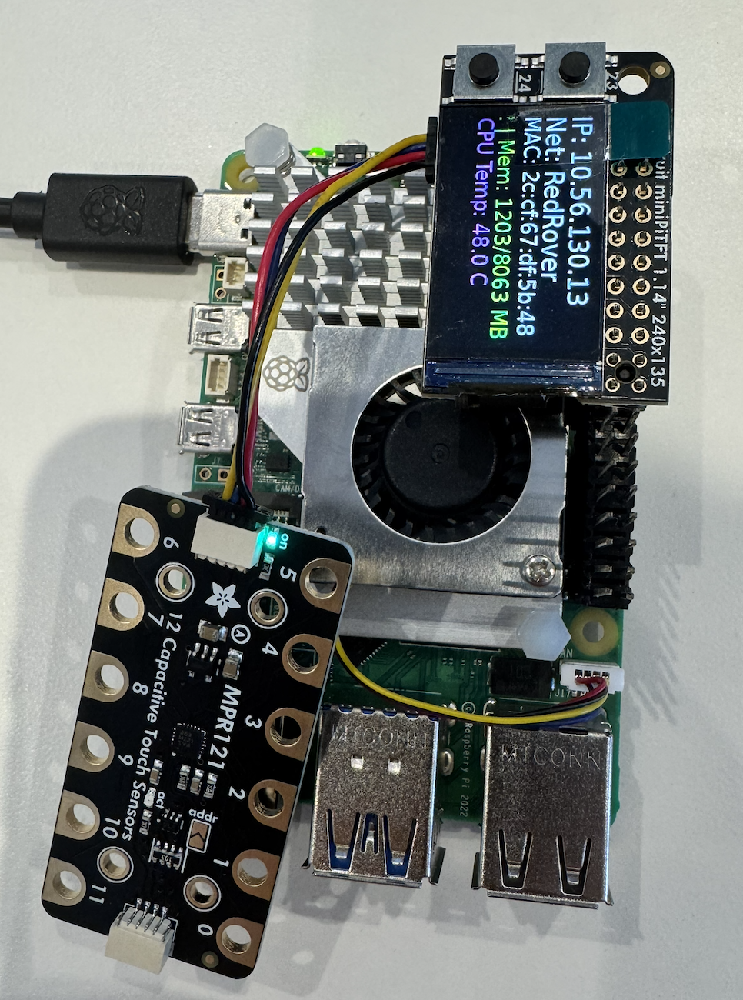
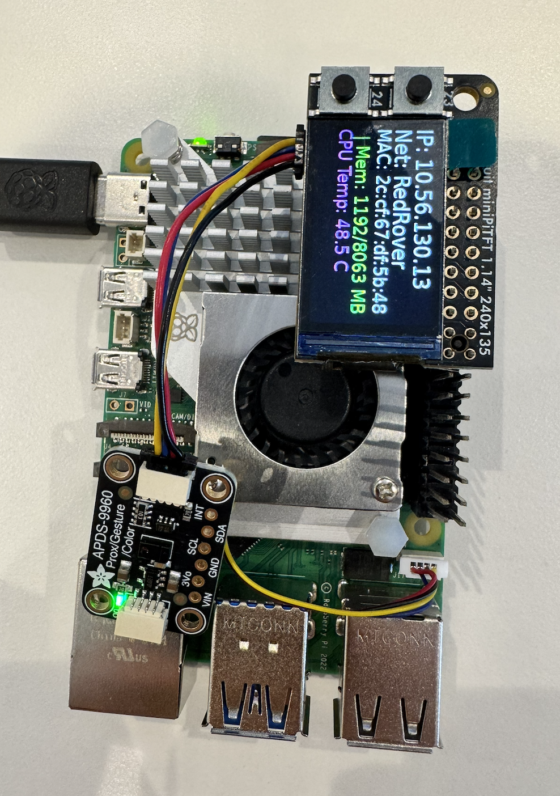
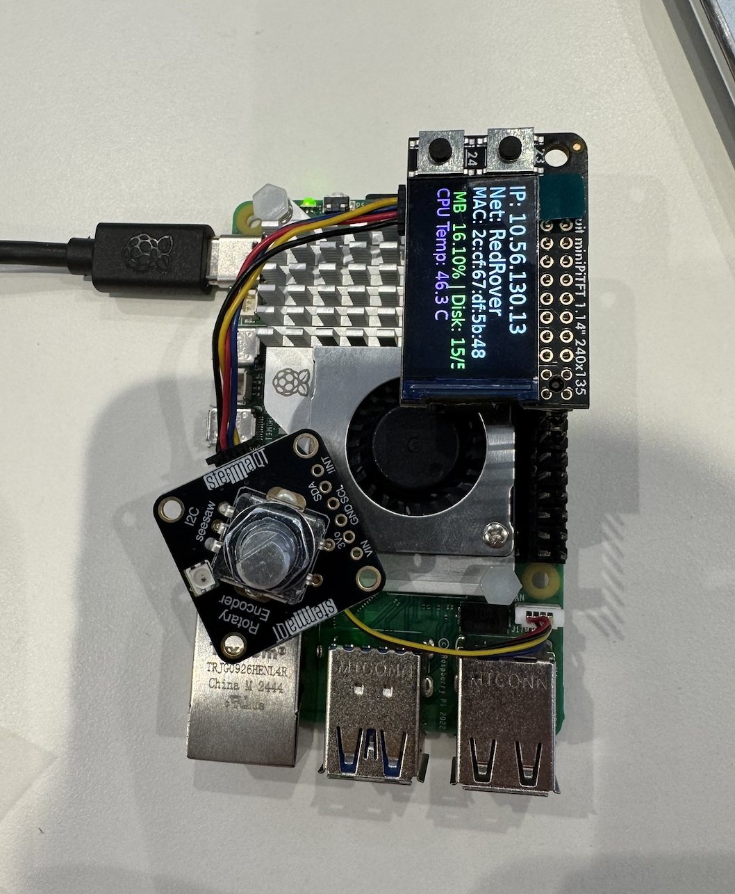
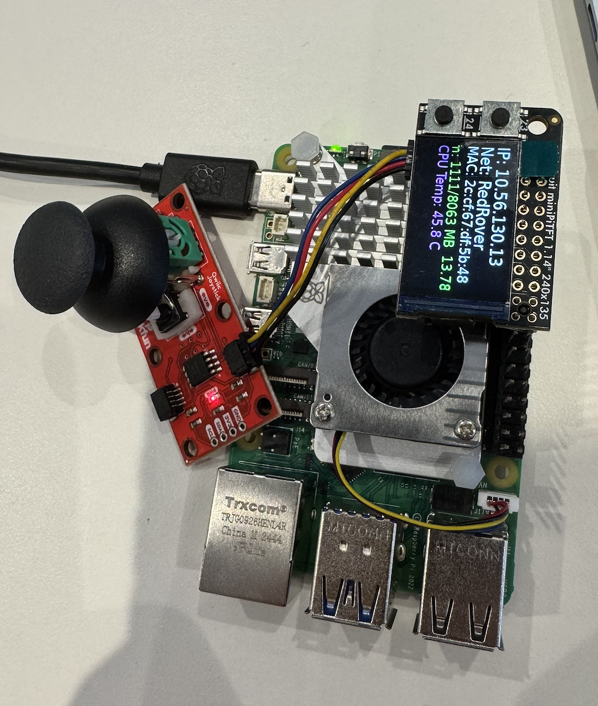
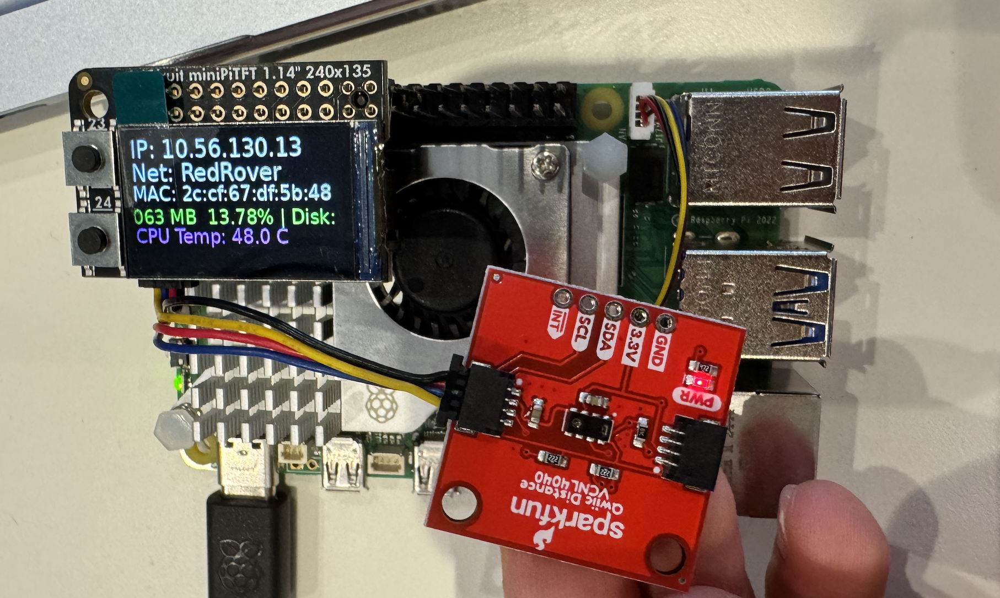
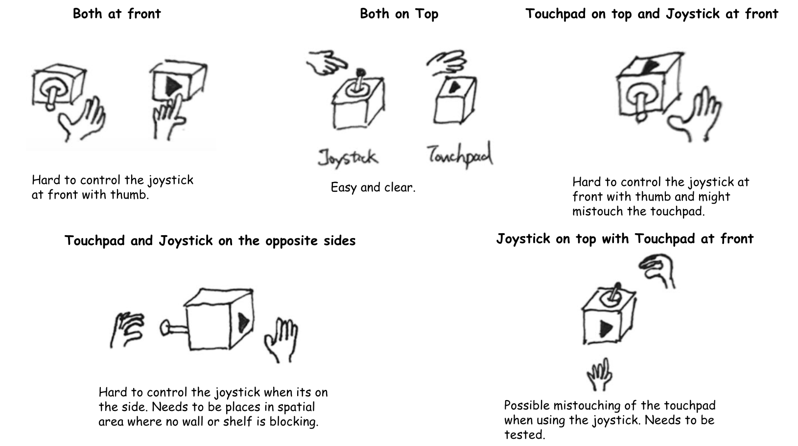
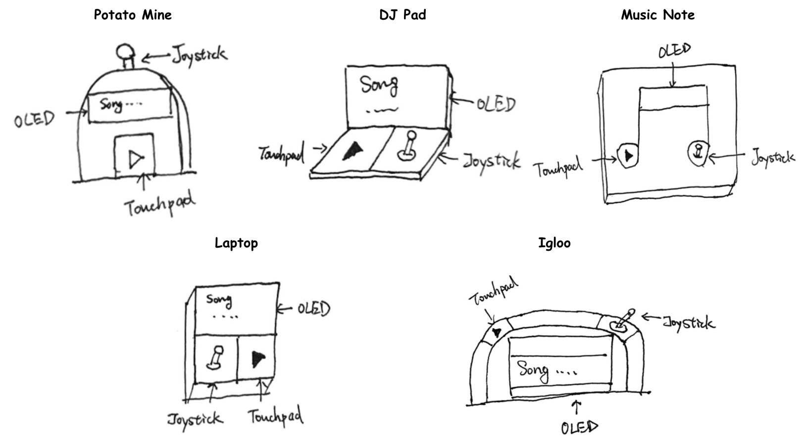
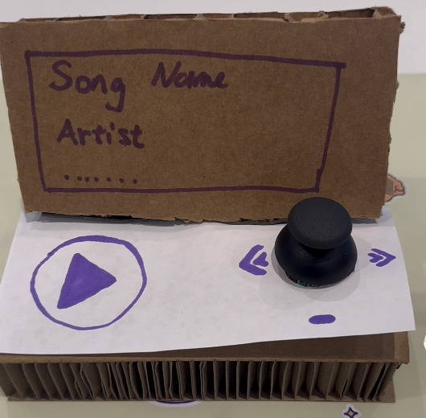

## Lab 4


### Part 1 (Week 1)
*️⃣ **A. Capacitive Sensing**
	- Photos/videos of your Twizzler (or other object) capacitive sensor setup
	- Code and terminal output showing touch detection

*️⃣ **B. More Sensors**
	- Photos/videos of each sensor tested (light/proximity, rotary encoder, joystick, distance sensor)
	- Code and terminal output for each sensor

*️⃣ **C. Physical Sensing Design**
	- 5 sketches of different ways to use your chosen sensor
	- Written reflection: questions raised, what to prototype
	- Pick one design to prototype and explain why

*️⃣ **D. Display & Housing**
	- 5 sketches for display/button/knob positioning
	- Written reflection: questions raised, what to prototype
	- Pick one display design to integrate
	- Rationale for design
	- Photos/videos of your cardboard prototype

---

### Part 2 (Week 2)
**Submit the following for Part 2:**  
*️⃣ **E. Multi-Device Demo**
	- Code and video for your multi-input multi-output demo (e.g., chaining Qwiic buttons, servo, GPIO expander, etc.)
	- Reflection on interaction effects and chaining

*️⃣ **F. Final Documentation**
	- Photos/videos of your final prototype
	- Written summary: what it looks like, works like, acts like
	- Reflection on what you learned and next steps

---

## Lab 4 Overview
###Collaborator: Wenzhuo Ma (wm356)###

## Part 1 Lab Preparation

## Deliverables \& Submission for Lab 4

The deliverables for this lab are, writings, sketches, photos, and videos that show what your prototype:
* "Looks like": shows how the device should look, feel, sit, weigh, etc.
* "Works like": shows what the device can do.
* "Acts like": shows how a person would interact with the device.

## Lab Overview

A) [Capacitive Sensing](#part-a)

B) [OLED screen](#part-b) 

C) [Paper Display](#part-c)

D) [Materiality](#part-d)

E) [Servo Control](#part-e)

F) [Record the interaction](#part-f)


## The Report (Part 1: A-D, Part 2: E-F)

### Quick Start: Python Environment Setup

1. **Create and activate a virtual environment in Lab 4:**
	```bash
	cd ~/Interactive-Lab-Hub/Lab\ 4
	python3 -m venv .venv
	source .venv/bin/activate
	```
2. **Install all Lab 4 requirements:**
	```bash
	pip install -r requirements2025.txt
	```
3. **Check CircuitPython Blinka installation:**
	```bash
	python blinkatest.py
	```
	If you see "Hello blinka!", your setup is correct.

### Part A
### Test for Capacitive Sensing, a.k.a. Human-Twizzler Interaction 
Set up photo:


#### Test for directly touching Twizzler:
Video:

log info:

```
(.venv) pi@max:~/Interactive-Lab-Hub/Lab 4 $ python cap_test.py 
Twizzler 2 touched!
Twizzler 7 touched!
Twizzler 11 touched!
Twizzler 11 touched!
Twizzler 11 touched!
Twizzler 11 touched!
Twizzler 0 touched!
Twizzler 1 touched!
Twizzler 1 touched!
Twizzler 9 touched!
Twizzler 9 touched!
Twizzler 9 touched!
```

#### Test for touching Twizzler connecting to a conductor:

Video:

log info:

```
(.venv) pi@max:~/Interactive-Lab-Hub/Lab 4 $ python cap_test.py 
Twizzler 9 touched!
Twizzler 9 touched!
Twizzler 9 touched!
Twizzler 9 touched!
Twizzler 9 touched!
Twizzler 9 touched!
```

### Part B
### More sensors

#### Test for Light/Proximity/Gesture sensor (APDS-9960)

Set up photo:


#### Test for proximity_test.py:

Video:

log info:

```
(.venv) pi@max:~/Interactive-Lab-Hub/Lab 4 $ python proximity_test.py
0
0
0
0
0
0
0
0
0
0
2
1
1
1
3
6
12
17
27
41
63
116
155
188
193
191
197
133
51
33
15
7
5
3
2
2
0
1
1
2
2
2
3
4
5
7
8
7
7
10
11
12
13
14
17
20
19
22
23
28
37
39
69
148
200
229
250
229
53
21
32
25
16
1
0
0
```

#### Test for python gesture_test.py

Video:

log info:

```
(.venv) pi@max:~/Interactive-Lab-Hub/Lab 4 $ python gesture_test.py
up
down
left
right
up
```

#### Test for python python color_test.py

Video:

log info:

```
(.venv) pi@max:~/Interactive-Lab-Hub/Lab 4 $ python color_test.py
red:  6536
green:  3846
blue:  2644
clear:  12522
color temp 1990.6272888854146
light lux 2013.2632200000003
red:  763
green:  499
blue:  375
clear:  1797
color temp 2522.5192015127095
light lux 265.42479999999995
red:  605
green:  407
blue:  228
clear:  1254
color temp 2277.817358077517
light lux 279.10181000000006
```

#### Test for Rotary Encoder 

Set up photo:


Video:

log info:

```
(.venv) pi@max:~/Interactive-Lab-Hub/Lab 4 $ python encoder_test.py
Found product 4991
Position: 0
Position: -1
Position: -3
Position: -4
Position: -5
Position: -6
Position: -7
Position: -8
Position: -7
Position: -6
Position: -5
Position: -4
Position: -3
Position: -2
Position: -1
Position: 0
Position: 1
Position: 2
Position: 3
Position: 4
Position: 5
Position: 6
Position: 7
Position: 8
Position: 9
Position: 10
Position: 11
Position: 12
Position: 13
Position: 14
```

#### Test for Joystick 

Set up photo:


Video:

log info:

```
(.venv) pi@max:~/Interactive-Lab-Hub/Lab 4 $ python joystick_test.py

SparkFun qwiic Joystick   Example 1

Initialized. Firmware Version: v 2.6
X: 524, Y: 514, Button: 1
X: 524, Y: 514, Button: 1
X: 524, Y: 514, Button: 1
X: 524, Y: 514, Button: 1
X: 524, Y: 514, Button: 1
X: 524, Y: 1023, Button: 1
X: 524, Y: 514, Button: 1
X: 524, Y: 514, Button: 1
X: 520, Y: 514, Button: 1
X: 524, Y: 514, Button: 1
X: 524, Y: 514, Button: 1
X: 524, Y: 514, Button: 1
X: 1023, Y: 514, Button: 1
X: 524, Y: 514, Button: 1
X: 524, Y: 514, Button: 1
X: 0, Y: 400, Button: 1
X: 66, Y: 378, Button: 1
X: 524, Y: 514, Button: 1
X: 524, Y: 514, Button: 1
X: 524, Y: 514, Button: 1
X: 524, Y: 514, Button: 1
X: 524, Y: 514, Button: 1
X: 524, Y: 514, Button: 1
```

#### Test for Distance Sensor

Set up photo:


Video:

log info:

```
(.venv) pi@max:~/Interactive-Lab-Hub/Lab 4 $ python qwiic_distance.py

SparkFun Proximity Sensor VCN4040 Example 1

Proximity Value: 1
Proximity Value: 1
Proximity Value: 1
Proximity Value: 1
Proximity Value: 3
Proximity Value: 56
Proximity Value: 500
Proximity Value: 620
Proximity Value: 622
Proximity Value: 64
Proximity Value: 23
Proximity Value: 14
Proximity Value: 8
Proximity Value: 5
Proximity Value: 4
Proximity Value: 2
Proximity Value: 2
Proximity Value: 3
Proximity Value: 2
Proximity Value: 3
Proximity Value: 2
Proximity Value: 2
Proximity Value: 2
Proximity Value: 1
Proximity Value: 1
Proximity Value: 1
Proximity Value: 1
Proximity Value: 1
Proximity Value: 1
Proximity Value: 2
Proximity Value: 3
Proximity Value: 5
Proximity Value: 10
Proximity Value: 18
Proximity Value: 31
Proximity Value: 61
Proximity Value: 129
Proximity Value: 282
Proximity Value: 534
Proximity Value: 1264
Proximity Value: 3946
Proximity Value: 20137
Proximity Value: 20066
Proximity Value: 16977
Proximity Value: 12042
Proximity Value: 585
Proximity Value: 31
```

### Part C
### Physical considerations for sensing

**\*\*\*Draw 5 sketches of different ways you might use your sensor, and how the larger device needs to be shaped in order to make the sensor useful.\*\*\***



**\*\*\*What are some things these sketches raise as questions? What do you need to physically prototype to understand how to anwer those questions?\*\*\***

These sketches raise several questions about comfort, usability, and how the parts fit together. For example, it is unclear which layout feels the most comfortable to use, or if people might accidentally touch the pad while moving the joystick. The sketches also make me wonder whether the controller should sit on a table, be held in the hand, or stand upright, and if the joystick is still easy to move in each position. I also need to think about how the wires and parts fit inside the box. To answer these questions, I need to build a cardboard model to test how people hold and use the device, see if any touches would cause accidentally and check that all the parts can fit and work properly.

**\*\*\*Pick one of these designs to prototype.\*\*\***

You can watch the demo video: (https://drive.google.com/file/d/1Dl_3RgF6iVdlgRXepE26UaXHCEjDCt_f/view?usp=sharing))

We chose to put both the touchpad and joystick on the top surface. I think this arrangement makes it easier for the user to control both with one or two hands while keeping the device stable on a table. The top layout also helps prevent accidental touches and makes the joystick movement smoother.

### Part D
### Physical considerations for displaying information and housing parts

**\*\*\*Sketch 5 designs for how you would physically position your display and any buttons or knobs needed to interact with it.\*\*\***



**\*\*\*What are some things these sketches raise as questions? What do you need to physically prototype to understand how to anwer those questions?\*\*\***

These sketches show several designs of how the display and controls could be arranged to make the device easy and comfortable to use, each with a different appearance. For example, it's unclear which layout allows users to see the OLED screen clearly while using the joystick and touchpad at the same time. Some shapes, like the "Potato Mine" or "Igloo", look fun but might be harder to build or to fit all the parts inside. The "DJ Pad" and "Laptop" designs make the screen more visible, but they could take up more space on a desk. It's also important to consider whether the joystick and touchpad are too close together or if users might accidentally press the wrong control. To answer these questions, I need to build a cardboard model to test how each design feels to use, how easy it is to see the display while interacting, and which layout best fits the components inside the box.

**\*\*\*Pick one of these display designs to integrate into your prototype.\*\*\***

**\*\*\*Explain the rationale for the design.\*\*\*** (e.g. Does it need to be a certain size or form or need to be able to be seen from a certain distance?)

We picked the Laptop design because it allows both the joystick and touchpad to be placed side by side, making them easy to reach and use at the same time. The OLED screen is positioned above them, similar to a laptop display, which makes it easy to see while interacting with the controls. This setup also keeps the device compact and stable on a flat surface, which is useful for desktop use. While the size of the screen is slightly small but clear enough to show essential information like the current song name with the artist name. 

**\*\*\*Document your rough prototype.\*\*\***



You can watch the demo video: (https://drive.google.com/file/d/1qNc5Mcd5SbnA4Rmggszs_ECRqs1J-wYU/view?usp=sharing)

Music Controller – Laptop Design:

For the prototype, we chose the Laptop design because it offers a clear and practical layout for both viewing and interaction. The OLED display is placed on the upper panel, similar to a laptop screen with an angle that easy for read, while the joystick and touchpad are on the lower surface for easy access. This setup allows users to see the display while controlling the music functions with both hands. The cardboard model helped test spacing and comfort, showing that the layout is stable. I found that slightly tilting the display backward would improve visibility and make the design more comfortable for longer use.


# LAB PART 2

### Part 2

Following exploration and reflection from Part 1, complete the "looks like," "works like" and "acts like" prototypes for your design, reiterated below.


### Part E

#### Chaining Devices and Exploring Interaction Effects

For Part 2, you will design and build a fun interactive prototype using multiple inputs and outputs. This means chaining Qwiic and STEMMA QT devices (e.g., buttons, encoders, sensors, servos, displays) and/or combining with traditional breadboard prototyping (e.g., LEDs, buzzers, etc.).

**Your prototype should:**
- Combine at least two different types of input and output devices, inspired by your physical considerations from Part 1.
- Be playful, creative, and demonstrate multi-input/multi-output interaction.

**Document your system with:**
- Code for your multi-device demo
- Photos and/or video of the working prototype in action
- A simple interaction diagram or sketch showing how inputs and outputs are connected and interact
- Written reflection: What did you learn about multi-input/multi-output interaction? What was fun, surprising, or challenging?

**Questions to consider:**
- What new types of interaction become possible when you combine two or more sensors or actuators?
- How does the physical arrangement of devices (e.g., where the encoder or sensor is placed) change the user experience?
- What happens if you use one device to control or modulate another (e.g., encoder sets a threshold, sensor triggers an action)?
- How does the system feel if you swap which device is "primary" and which is "secondary"?

Try chaining different combinations and document what you discover!

See encoder_accel_servo_dashboard.py in the Lab 4 folder for an example of chaining together three devices.

**`Lab 4/encoder_accel_servo_dashboard.py`**

#### Using Multiple Qwiic Buttons: Changing I2C Address (Physically & Digitally)

If you want to use more than one Qwiic Button in your project, you must give each button a unique I2C address. There are two ways to do this:

##### 1. Physically: Soldering Address Jumpers

On the back of the Qwiic Button, you'll find four solder jumpers labeled A0, A1, A2, and A3. By bridging these with solder, you change the I2C address. Only one button on the chain can use the default address (0x6F).

**Address Table:**

| A3 | A2 | A1 | A0 | Address (hex) |
|----|----|----|----|---------------|
|  0 |  0 |  0 |  0 |    0x6F       |
|  0 |  0 |  0 |  1 |    0x6E       |
|  0 |  0 |  1 |  0 |    0x6D       |
|  0 |  0 |  1 |  1 |    0x6C       |
|  0 |  1 |  0 |  0 |    0x6B       |
|  0 |  1 |  0 |  1 |    0x6A       |
|  0 |  1 |  1 |  0 |    0x69       |
|  0 |  1 |  1 |  1 |    0x68       |
|  1 |  0 |  0 |  0 |    0x67       |
| ...| ...| ...| ... |     ...      |

For example, if you solder A0 closed (leave A1, A2, A3 open), the address becomes 0x6E.

**Soldering Tips:**
- Use a small amount of solder to bridge the pads for the jumper you want to close.
- Only one jumper needs to be closed for each address change (see table above).
- Power cycle the button after changing the jumper.

##### 2. Digitally: Using Software to Change Address

You can also change the address in software (temporarily or permanently) using the example script `qwiic_button_ex6_changeI2CAddress.py` in the Lab 4 folder. This is useful if you want to reassign addresses without soldering.

Run the script and follow the prompts:
```bash
python qwiic_button_ex6_changeI2CAddress.py
```
Enter the new address (e.g., 5B for 0x5B) when prompted. Power cycle the button after changing the address.

**Note:** The software method is less foolproof and you need to make sure to keep track of which button has which address!


##### Using Multiple Buttons in Code

After setting unique addresses, you can use multiple buttons in your script. See these example scripts in the Lab 4 folder:

- **`qwiic_1_button.py`**: Basic example for reading a single Qwiic Button (default address 0x6F). Run with:
	```bash
	python qwiic_1_button.py
	```

- **`qwiic_button_led_demo.py`**: Demonstrates using two Qwiic Buttons at different addresses (e.g., 0x6F and 0x6E) and controlling their LEDs. Button 1 toggles its own LED; Button 2 toggles both LEDs. Run with:
	```bash
	python qwiic_button_led_demo.py
	```

Here is a minimal code example for two buttons:
```python
import qwiic_button

# Default button (0x6F)
button1 = qwiic_button.QwiicButton()
# Button with A0 soldered (0x6E)
button2 = qwiic_button.QwiicButton(0x6E)

button1.begin()
button2.begin()

while True:
		if button1.is_button_pressed():
				print("Button 1 pressed!")
		if button2.is_button_pressed():
				print("Button 2 pressed!")
```

For more details, see the [Qwiic Button Hookup Guide](https://learn.sparkfun.com/tutorials/qwiic-button-hookup-guide/all#i2c-address).

---

### PCF8574 GPIO Expander: Add More Pins Over I²C

Sometimes your Pi’s header GPIO pins are already full (e.g., with a display or HAT). That’s where an I²C GPIO expander comes in handy.

We use the Adafruit PCF8574 I²C GPIO Expander, which gives you 8 extra digital pins over I²C. It’s a great way to prototype with LEDs, buttons, or other components on the breadboard without worrying about pin conflicts—similar to how Arduino users often expand their pinouts when prototyping physical interactions.

**Why is this useful?**
- You only need two wires (I²C: SDA + SCL) to unlock 8 extra GPIOs.
- It integrates smoothly with CircuitPython and Blinka.
- It allows a clean prototyping workflow when the Pi’s 40-pin header is already occupied by displays, HATs, or sensors.
- Makes breadboard setups feel more like an Arduino-style prototyping environment where it’s easy to wire up interaction elements.

**Demo Script:** `Lab 4/gpio_expander.py`

<p align="center">
    
</p>

We connected 8 LEDs (through 220 Ω resistors) to the expander and ran a little light show. The script cycles through three patterns:
- Chase (one LED at a time, left to right)
- Knight Rider (back-and-forth sweep)
- Disco (random blink chaos)

Every few runs, the script swaps to the next pattern automatically:
```bash
python gpio_expander.py
```

This is a playful way to visualize how the expander works, but the same technique applies if you wanted to prototype buttons, switches, or other interaction elements. It’s a lightweight, flexible addition to your prototyping toolkit.

---

### Servo Control with SparkFun Servo pHAT
For this lab, you will use the **SparkFun Servo pHAT** to control a micro servo (such as the Miuzei MS18 or similar 9g servo). The Servo pHAT stacks directly on top of the Adafruit Mini PiTFT (135×240) display without pin conflicts:
- The Mini PiTFT uses SPI (GPIO22, 23, 24, 25) for display and buttons ([SPI pinout](https://pinout.xyz/pinout/spi)).
- The Servo pHAT uses I²C (GPIO2 & 3) for the PCA9685 servo driver ([I2C pinout](https://pinout.xyz/pinout/i2c)).
- Since SPI and I²C are separate buses, you can use both boards together.
**⚡ Power:**
- Plug a USB-C cable into the Servo pHAT to provide enough current for the servos. The Pi itself should still be powered by its own USB-C supply. Do NOT power servos from the Pi’s 5V rail.

<p align="center">
    
</p>

**Basic Python Example:**
We provide a simple example script: `Lab 4/pi_servo_hat_test.py` (requires the `pi_servo_hat` Python package).
Run the example:
```
python pi_servo_hat_test.py
```
For more details and advanced usage, see the [official SparkFun Servo pHAT documentation](https://learn.sparkfun.com/tutorials/pi-servo-phat-v2-hookup-guide/all#resources-and-going-further).
A servo motor is a rotary actuator that allows for precise control of angular position. The position is set by the width of an electrical pulse (PWM). You can read [this Adafruit guide](https://learn.adafruit.com/adafruit-arduino-lesson-14-servo-motors/servo-motors) to learn more about how servos work.

---


### Part F

### Record

Document all the prototypes and iterations you have designed and worked on! Again, deliverables for this lab are writings, sketches, photos, and videos that show what your prototype:
* "Looks like": shows how the device should look, feel, sit, weigh, etc.
* "Works like": shows what the device can do
* "Acts like": shows how a person would interact with the device

