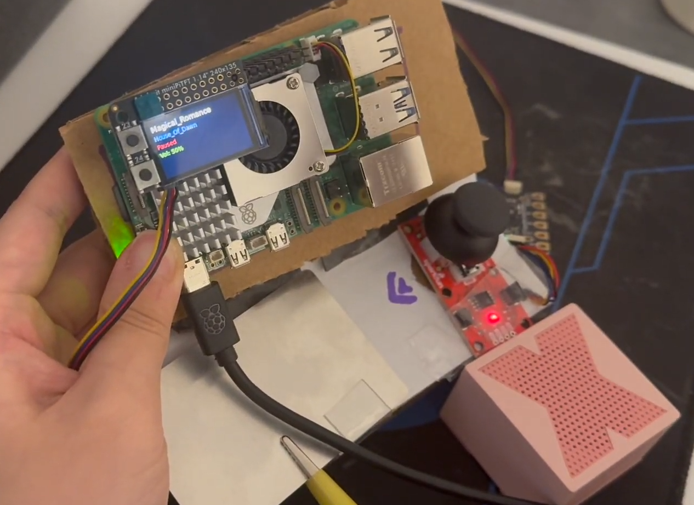
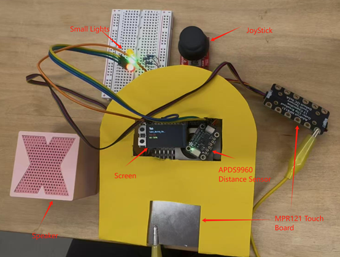

## Lab 4


### Part 1 (Week 1)
*️⃣ **A. Capacitive Sensing**
	- Photos/videos of your Twizzler (or other object) capacitive sensor setup
	- Code and terminal output showing touch detection

*️⃣ **B. More Sensors**
	- Photos/videos of each sensor tested (light/proximity, rotary encoder, joystick, distance sensor)
	- Code and terminal output for each sensor

*️⃣ **C. Physical Sensing Design**
	- 5 sketches of different ways to use your chosen sensor
	- Written reflection: questions raised, what to prototype
	- Pick one design to prototype and explain why

*️⃣ **D. Display & Housing**
	- 5 sketches for display/button/knob positioning
	- Written reflection: questions raised, what to prototype
	- Pick one display design to integrate
	- Rationale for design
	- Photos/videos of your cardboard prototype

---

### Part 2 (Week 2)
**Submit the following for Part 2:**  
*️⃣ **E. Multi-Device Demo**
	- Code and video for your multi-input multi-output demo (e.g., chaining Qwiic buttons, servo, GPIO expander, etc.)
	- Reflection on interaction effects and chaining

*️⃣ **F. Final Documentation**
	- Photos/videos of your final prototype
	- Written summary: what it looks like, works like, acts like
	- Reflection on what you learned and next steps

---

## Lab 4 Overview
###Collaborator: Wenzhuo Ma (wm356)###

## Part 1 Lab Preparation

## Deliverables \& Submission for Lab 4

The deliverables for this lab are, writings, sketches, photos, and videos that show what your prototype:
* "Looks like": shows how the device should look, feel, sit, weigh, etc.
* "Works like": shows what the device can do.
* "Acts like": shows how a person would interact with the device.

## Lab Overview

A) [Capacitive Sensing](#part-a)

B) [OLED screen](#part-b) 

C) [Paper Display](#part-c)

D) [Materiality](#part-d)

E) [Servo Control](#part-e)

F) [Record the interaction](#part-f)


## The Report (Part 1: A-D, Part 2: E-F)

### Quick Start: Python Environment Setup

1. **Create and activate a virtual environment in Lab 4:**
	```bash
	cd ~/Interactive-Lab-Hub/Lab\ 4
	python3 -m venv .venv
	source .venv/bin/activate
	```
2. **Install all Lab 4 requirements:**
	```bash
	pip install -r requirements2025.txt
	```
3. **Check CircuitPython Blinka installation:**
	```bash
	python blinkatest.py
	```
	If you see "Hello blinka!", your setup is correct.


### Part A
### Test for Capacitive Sensing, a.k.a. Human-Twizzler Interaction 
Set up photo:


#### Test for directly touching Twizzler:
Video: [https://drive.google.com/file/d/1jtIyU4fzgyAFQZ10SFjRVbTX_9X6H59N/view?usp=sharing](https://drive.google.com/file/d/1jtIyU4fzgyAFQZ10SFjRVbTX_9X6H59N/view?usp=sharing)

log info:

```
(.venv) pi@max:~/Interactive-Lab-Hub/Lab 4 $ python cap_test.py 
Twizzler 2 touched!
Twizzler 7 touched!
Twizzler 11 touched!
Twizzler 11 touched!
Twizzler 11 touched!
Twizzler 11 touched!
Twizzler 0 touched!
Twizzler 1 touched!
Twizzler 1 touched!
Twizzler 9 touched!
Twizzler 9 touched!
Twizzler 9 touched!
```

#### Test for touching Twizzler connecting to a conductor:

Video:[https://drive.google.com/file/d/1I-tb-lTlRMRaVxKZEWBnxo6AMztpMPcA/view?usp=drive_link](https://drive.google.com/file/d/1I-tb-lTlRMRaVxKZEWBnxo6AMztpMPcA/view?usp=drive_link)


log info:

```
(.venv) pi@max:~/Interactive-Lab-Hub/Lab 4 $ python cap_test.py 
Twizzler 9 touched!
Twizzler 9 touched!
Twizzler 9 touched!
Twizzler 9 touched!
Twizzler 9 touched!
Twizzler 9 touched!
```

### Part B
### More sensors

#### Test for Light/Proximity/Gesture sensor (APDS-9960)

Set up photo:


#### Test for proximity_test.py:

Video:[https://drive.google.com/file/d/1cLOCBwlsfwFD6SLhqpRPtK6jyAotpeGS/view?usp=drive_link](https://drive.google.com/file/d/1cLOCBwlsfwFD6SLhqpRPtK6jyAotpeGS/view?usp=drive_link)

log info:

```
(.venv) pi@max:~/Interactive-Lab-Hub/Lab 4 $ python proximity_test.py
0
0
0
0
0
0
0
0
0
0
2
1
1
1
3
6
12
17
27
41
63
116
155
188
193
191
197
133
51
33
15
7
5
3
2
2
0
1
1
2
2
2
3
4
5
7
8
7
7
10
11
12
13
14
17
20
19
22
23
28
37
39
69
148
200
229
250
229
53
21
32
25
16
1
0
0
```

#### Test for python gesture_test.py

Video:[https://drive.google.com/file/d/1iwvdlU0op5dFtTBxByexz7uFNlAtNyES/view?usp=drive_link](https://drive.google.com/file/d/1iwvdlU0op5dFtTBxByexz7uFNlAtNyES/view?usp=drive_link)

log info:

```
(.venv) pi@max:~/Interactive-Lab-Hub/Lab 4 $ python gesture_test.py
up
down
left
right
up
```

#### Test for python python color_test.py

Video:[https://drive.google.com/file/d/1RKQZQ6ctD7I9oUKpsX780PhnJvhb6WkC/view?usp=drive_link](https://drive.google.com/file/d/1RKQZQ6ctD7I9oUKpsX780PhnJvhb6WkC/view?usp=drive_link)

log info:

```
(.venv) pi@max:~/Interactive-Lab-Hub/Lab 4 $ python color_test.py
red:  6536
green:  3846
blue:  2644
clear:  12522
color temp 1990.6272888854146
light lux 2013.2632200000003
red:  763
green:  499
blue:  375
clear:  1797
color temp 2522.5192015127095
light lux 265.42479999999995
red:  605
green:  407
blue:  228
clear:  1254
color temp 2277.817358077517
light lux 279.10181000000006
```

#### Test for Rotary Encoder 

Set up photo:


Video:[https://drive.google.com/file/d/1o-7zOtNsHrdKv-IvUMFV6fjNV6xq_pDC/view?usp=drive_link](https://drive.google.com/file/d/1o-7zOtNsHrdKv-IvUMFV6fjNV6xq_pDC/view?usp=drive_link)

log info:

```
(.venv) pi@max:~/Interactive-Lab-Hub/Lab 4 $ python encoder_test.py
Found product 4991
Position: 0
Position: -1
Position: -3
Position: -4
Position: -5
Position: -6
Position: -7
Position: -8
Position: -7
Position: -6
Position: -5
Position: -4
Position: -3
Position: -2
Position: -1
Position: 0
Position: 1
Position: 2
Position: 3
Position: 4
Position: 5
Position: 6
Position: 7
Position: 8
Position: 9
Position: 10
Position: 11
Position: 12
Position: 13
Position: 14
```

#### Test for Joystick 

Set up photo:


Video:[https://drive.google.com/file/d/1SOgJV07gCmHdvlncBlJw9fFS8DV8Rsjm/view?usp=drive_link](https://drive.google.com/file/d/1SOgJV07gCmHdvlncBlJw9fFS8DV8Rsjm/view?usp=drive_link)


log info:

```
(.venv) pi@max:~/Interactive-Lab-Hub/Lab 4 $ python joystick_test.py

SparkFun qwiic Joystick   Example 1

Initialized. Firmware Version: v 2.6
X: 524, Y: 514, Button: 1
X: 524, Y: 514, Button: 1
X: 524, Y: 514, Button: 1
X: 524, Y: 514, Button: 1
X: 524, Y: 514, Button: 1
X: 524, Y: 1023, Button: 1
X: 524, Y: 514, Button: 1
X: 524, Y: 514, Button: 1
X: 520, Y: 514, Button: 1
X: 524, Y: 514, Button: 1
X: 524, Y: 514, Button: 1
X: 524, Y: 514, Button: 1
X: 1023, Y: 514, Button: 1
X: 524, Y: 514, Button: 1
X: 524, Y: 514, Button: 1
X: 0, Y: 400, Button: 1
X: 66, Y: 378, Button: 1
X: 524, Y: 514, Button: 1
X: 524, Y: 514, Button: 1
X: 524, Y: 514, Button: 1
X: 524, Y: 514, Button: 1
X: 524, Y: 514, Button: 1
X: 524, Y: 514, Button: 1
```

#### Test for Distance Sensor

Set up photo:


Video:[https://drive.google.com/file/d/1cSJWj98R7OTybSJ-Pzs8wXq9cjfAnhoj/view?usp=drive_link](https://drive.google.com/file/d/1cSJWj98R7OTybSJ-Pzs8wXq9cjfAnhoj/view?usp=drive_link)

log info:

```
(.venv) pi@max:~/Interactive-Lab-Hub/Lab 4 $ python qwiic_distance.py

SparkFun Proximity Sensor VCN4040 Example 1

Proximity Value: 1
Proximity Value: 1
Proximity Value: 1
Proximity Value: 1
Proximity Value: 3
Proximity Value: 56
Proximity Value: 500
Proximity Value: 620
Proximity Value: 622
Proximity Value: 64
Proximity Value: 23
Proximity Value: 14
Proximity Value: 8
Proximity Value: 5
Proximity Value: 4
Proximity Value: 2
Proximity Value: 2
Proximity Value: 3
Proximity Value: 2
Proximity Value: 3
Proximity Value: 2
Proximity Value: 2
Proximity Value: 2
Proximity Value: 1
Proximity Value: 1
Proximity Value: 1
Proximity Value: 1
Proximity Value: 1
Proximity Value: 1
Proximity Value: 2
Proximity Value: 3
Proximity Value: 5
Proximity Value: 10
Proximity Value: 18
Proximity Value: 31
Proximity Value: 61
Proximity Value: 129
Proximity Value: 282
Proximity Value: 534
Proximity Value: 1264
Proximity Value: 3946
Proximity Value: 20137
Proximity Value: 20066
Proximity Value: 16977
Proximity Value: 12042
Proximity Value: 585
Proximity Value: 31
```

### Part C
### Physical considerations for sensing

**\*\*\*Draw 5 sketches of different ways you might use your sensor, and how the larger device needs to be shaped in order to make the sensor useful.\*\*\***


**\*\*\*What are some things these sketches raise as questions? What do you need to physically prototype to understand how to anwer those questions?\*\*\***

These sketches raise several questions about comfort, usability, and how the parts fit together. For example, it is unclear which layout feels the most comfortable to use, or if people might accidentally touch the pad while moving the joystick. The sketches also make me wonder whether the controller should sit on a table, be held in the hand, or stand upright, and if the joystick is still easy to move in each position. I also need to think about how the wires and parts fit inside the box. To answer these questions, I need to build a cardboard model to test how people hold and use the device, see if any touches would cause accidentally and check that all the parts can fit and work properly.

**\*\*\*Pick one of these designs to prototype.\*\*\***

You can watch the demo video: (https://drive.google.com/file/d/1Dl_3RgF6iVdlgRXepE26UaXHCEjDCt_f/view?usp=sharing))

We chose to put both the touchpad and joystick on the top surface. I think this arrangement makes it easier for the user to control both with one or two hands while keeping the device stable on a table. The top layout also helps prevent accidental touches and makes the joystick movement smoother.

### Part D
### Physical considerations for displaying information and housing parts

**\*\*\*Sketch 5 designs for how you would physically position your display and any buttons or knobs needed to interact with it.\*\*\***


**\*\*\*What are some things these sketches raise as questions? What do you need to physically prototype to understand how to anwer those questions?\*\*\***

These sketches show several designs of how the display and controls could be arranged to make the device easy and comfortable to use, each with a different appearance. For example, it's unclear which layout allows users to see the OLED screen clearly while using the joystick and touchpad at the same time. Some shapes, like the "Potato Mine" or "Igloo", look fun but might be harder to build or to fit all the parts inside. The "DJ Pad" and "Laptop" designs make the screen more visible, but they could take up more space on a desk. It's also important to consider whether the joystick and touchpad are too close together or if users might accidentally press the wrong control. To answer these questions, I need to build a cardboard model to test how each design feels to use, how easy it is to see the display while interacting, and which layout best fits the components inside the box.

**\*\*\*Pick one of these display designs to integrate into your prototype.\*\*\***

**\*\*\*Explain the rationale for the design.\*\*\*** (e.g. Does it need to be a certain size or form or need to be able to be seen from a certain distance?)

We picked the Laptop design because it allows both the joystick and touchpad to be placed side by side, making them easy to reach and use at the same time. The OLED screen is positioned above them, similar to a laptop display, which makes it easy to see while interacting with the controls. This setup also keeps the device compact and stable on a flat surface, which is useful for desktop use. While the size of the screen is slightly small but clear enough to show essential information like the current song name with the artist name. 

**\*\*\*Document your rough prototype.\*\*\***


You can watch the demo video: (https://drive.google.com/file/d/1qNc5Mcd5SbnA4Rmggszs_ECRqs1J-wYU/view?usp=sharing)

Music Controller – Laptop Design:

For the prototype, we chose the Laptop design because it offers a clear and practical layout for both viewing and interaction. The OLED display is placed on the upper panel, similar to a laptop screen with an angle that easy for read, while the joystick and touchpad are on the lower surface for easy access. This setup allows users to see the display while controlling the music functions with both hands. The cardboard model helped test spacing and comfort, showing that the layout is stable. I found that slightly tilting the display backward would improve visibility and make the design more comfortable for longer use.


#### FeedBack

"The design of the controller is really new which I haven't seen and expected. I really like this design and demo. I think I will buy one to place on my desk which is interesting. While I think it may be a good idea to have some more functions as well. It will be good to make users can design the functions by themselves as there are so many units you can use. Also, the screen touch may be another improvement in the future. But in all I like it!"

——Yibin Wei

"In this era of voice commands and smart touchscreens, going back to controlling music with a joystick feels wonderfully nostalgic — that mechanical feedback actually makes listening to music more tangible and satisfying. As for the design, I have a small suggestion: what if you place the pad directly beneath the joystick? That way, users could perform multi-dimensional actions — up, down, left, right, and press — all from a single touchpoint. But then again, don’t many smart speakers already offer similar functionality?"

——Dean Xu

# LAB PART 2

### Part 2

### Part E

## Interactive Player v1:
Initially, we use the Design from first part

### Design:


### Prototype:



### Workflow:

In all, it is a Player to play music, music can be both mp3 and wav.
Music is stored in [./music](./music)

1. Screen: Screen shows the Song name, Artist, Volume and playing status.

2. Touchboard: Touchboard is connected with the Twizzler and only one pin is useful which is pin0. It is used to Pause/Play music (2s Protection after one touch)

3. JoyStick: Joystick is used for adjust volume and music. Volume can be up/down 5 with Joystick up/down (2s Protection after one adjustment). Music can be switched forward/backward with Joystick left/right (5s Protection after one switch).

### Video:
In the video, I touch the devices a lot times to show the protection mechanism.

[Demo Video Version 1](https://drive.google.com/file/d/1ebrkM2wU_Ngbhbl5PHCyEltDHRlG0HOn/view?usp=drive_link): [https://drive.google.com/file/d/1ebrkM2wU_Ngbhbl5PHCyEltDHRlG0HOn/view?usp=drive_link](https://drive.google.com/file/d/1ebrkM2wU_Ngbhbl5PHCyEltDHRlG0HOn/view?usp=drive_link)

### Quick Start

Code: [Interactive_player_v1.py](interactive_player_v1.py)  
Music folder: [./music](music)

---

## 1. Setup Environment

**1.1 Update system**
```bash
sudo apt update && sudo apt upgrade -y
```

**1.2 Install dependencies**
```bash
sudo apt install python3 python3-venv python3-pip python3-dev \
  python3-pil python3-pil.imagetk python3-pygame python3-lgpio \
  fonts-dejavu-core i2c-tools git -y
```

**2. Create and Activate Virtual Environment**
```bash
cd ~/Interactive-Lab-Hub/Lab\ 4
python3 -m venv venv
source venv/bin/activate
```

To reactivate later:

```bash
cd ~/Interactive-Lab-Hub/Lab\ 4 && source venv/bin/activate
```

**3. Install Python Libraries**
```bash
pip install --upgrade pip
pip install pygame Pillow adafruit-circuitpython-rgb-display \
            adafruit-circuitpython-mpr121 sparkfun-qwiic-joystick
```

**4. Hardware Connections**

| Module | Interface | Connection |
|--------|------------|-------------|
| ST7789 Display | SPI | CS → D5, DC → D25, RST → D24, BL → D22 |
| MPR121 Touch Sensor | I²C | SDA → SDA, SCL → SCL |
| Qwiic Joystick | I²C (Qwiic) | Address 0x20 |

**Note:** Ensure I²C devices do not share the same address.

**5. Run the Program**

```bash
python3 Interactive_player_v1.py
```

**6. Controls**
| Control | Function |
|----------|-----------|
| Twizzler touch | Play / Pause |
| Joystick left / right | Previous / Next song |
| Joystick up / down | Volume up / down |


### Peer Feedback:
"I really like the device, it is just the old style player which I haven't seen for decades. But I think it may be more interesting to add some of the interactive lights which also can make it cooler!"

——Li Wei

"The device is really good and I like the functions a lot! For the design, as I see you guys have a lot different design initially, what about use the Potato Mines design which is the first graph of the picture. I like that really much! Also you guys has a Joysticker, it will be interesting to play with that!"

——Fei Xu

### Processes

After we collected feedback from peers. We add some more interactions and change the design to imrove our player. Then Version 2 is created.


### Reflection:
**What did you learn about multi-input/multi-output interaction? What was fun, surprising, or challenging?**

I learned that multi-input/multi-output interaction is about coordinating relationships rather than just adding more sensors or outputs. It was fun to see how combining touch, joystick, and proximity sensors created unexpected layers of control and feedback. The most challenging part was synchronizing timing between devices so that inputs didn’t conflict, while the most surprising was how small physical layout changes could completely shift the user experience.

**What new types of interaction become possible when you combine two or more sensors or actuators?**

Combining touch, joystick, and proximity sensors allowed layered control — for example, touch toggles playback, joystick changes tracks or volume, and proximity modulates LED patterns. These overlapping inputs created richer, context-sensitive responses instead of simple one-to-one actions.

**How does the physical arrangement of devices change the user experience?**

The position of sensors strongly affected intuitiveness — placing the proximity sensor near the display made users naturally reach toward the screen, reinforcing the link between movement and visual feedback. Physical grouping helped users perceive the system as one cohesive interface.

**What happens if you use one device to control or modulate another?**

Letting proximity or joystick input change LED behavior made the system feel more dynamic and expressive. It turned simple actions into layered feedback, giving users a sense of “live” control beyond basic commands.

**How does the system feel if you swap which device is "primary" and which is "secondary"?**

When the joystick became primary (controlling music) and touch secondary (visual feedback), the system felt more instrument-like. Reversing that made it calmer and more display-focused, showing how hierarchy among inputs shapes the overall interaction tone.


### Peer Feedback:

""


---


### Part F

### Record

## Interactive Player:

### Design:

### Prototype:


### Workflow:

In all, it is a Player to play music, music can be both mp3 and wav.
Music is stored in [./music](./music)

1. Screen: Screen shows the Song name, Artist, Volume and playing status.

2. Touchboard: Touchboard is connected with the Twizzler and only one pin is useful which is pin0. It is used to Pause/Play music (2s Protection after one touch)

3. JoyStick: Joystick is used for adjust volume and music. Volume can be up/down 5 with Joystick up/down (2s Protection after one adjustment). Music can be switched forward/backward with Joystick left/right (5s Protection after one switch).

4. Small lights: There are three small lights. When music is paused, the lights are always on. When music is Playing the lights flashes and the flash logic is determined by the distance sensor.

5. Distantce sensor: Distance sensor is used to detect distance. When the hand is close to the distance sensor and the value the sensor detected is larger than 50, the lights darken one by one for 0.5s. When the hand is far from the sensor and the value the sensor deteced is smaller or equal to 50, the lights flashes together for 0.5s.

### Video:
In the video, I touch the devices a lot times to show the protection mechanism.

[Interactive_player_v2 Demo Video](https://drive.google.com/file/d/1U5S64xmguhD9As9GV8Me7hgE1hskPfrm/view?usp=sharing): [https://drive.google.com/file/d/1U5S64xmguhD9As9GV8Me7hgE1hskPfrm/view?usp=sharing](https://drive.google.com/file/d/1U5S64xmguhD9As9GV8Me7hgE1hskPfrm/view?usp=sharing)


### Quick Start:

Code: [Interactive_player_v2.py](interactive_player_v2.py)

Music folder: [./music](music)

### 1. Setup Environment

**1.1 Update system**
```bash
sudo apt update && sudo apt upgrade -y
```

**1.2 Install dependencies**

```bash
sudo apt install python3 python3-venv python3-pip python3-dev \
  python3-pil python3-pil.imagetk python3-pygame python3-lgpio \
  fonts-dejavu-core i2c-tools git -y
```

### 2. Create and Activate Virtual Environment

```bash
cd ~/Interactive-Lab-Hub/Lab\ 4
python3 -m venv venv
source venv/bin/activate
```

To reactivate later:

```bash
cd ~/Interactive-Lab-Hub/Lab\ 4 && source venv/bin/activate
```

### 3. Install Python Libraries

```bash
pip install --upgrade pip
pip install pygame Pillow adafruit-circuitpython-rgb-display \
            adafruit-circuitpython-mpr121 adafruit-circuitpython-apds9960 \
            sparkfun-qwiic-joystick
```

### 4. Hardware Connections

| Module | Interface | Connection |
|--------|------------|-------------|
| ST7789 Display | SPI | CS → D5, DC → D25, RST → D24, BL → D22 |
| MPR121 Touch Sensor | I²C | SDA → SDA, SCL → SCL |
| Qwiic Joystick | I²C (Qwiic) | Address 0x20 |
| APDS9960 Proximity | I²C | Address 0x39 |
| GPIO LEDs | GPIO | 18 / 19 / 20 with 220 Ω resistors |

**Note:** Use a Qwiic splitter or change ADDR pins if I²C address conflicts occur.

### 5. Run the Program
```bash
python3 Interactive_player_v2.py
```

### 6. Controls

| Control | Function |
|----------|-----------|
| Twizzler touch | Play / Pause |
| Joystick left / right | Previous / Next song |
| Joystick up / down | Volume up / down |
| Proximity sensor | Change LED pattern |
