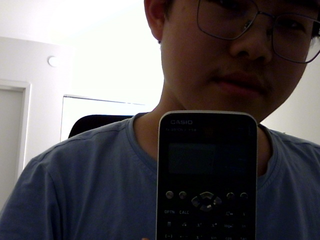
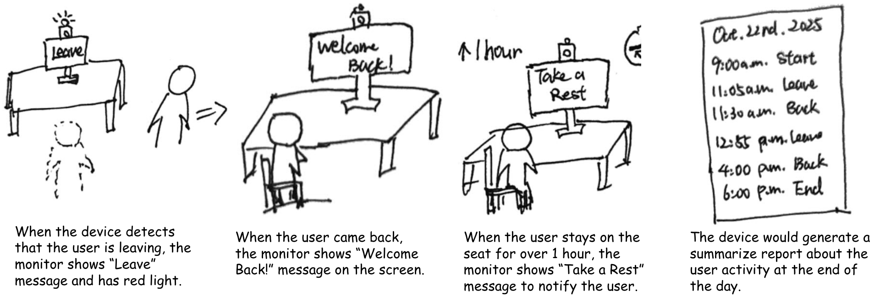

# Observant Systems

**Wenzhuo Ma - wm356**

**Dean Xu - hx332**


## Prep

1.  Install VNC on your laptop if you have not yet done so. This lab will actually require you to run script on your Pi through VNC so that you can see the video stream. Please refer to the [prep for Lab 2](https://github.com/FAR-Lab/Interactive-Lab-Hub/blob/-/Lab%202/prep.md#using-vnc-to-see-your-pi-desktop).
2.  Install the dependencies as described in the [prep document](prep.md). 
3.  Read about [OpenCV](https://opencv.org/about/),[Pytorch](https://pytorch.org/), [MediaPipe](https://mediapipe.dev/), and [TeachableMachines](https://teachablemachine.withgoogle.com/).
4.  Read Belloti, et al.'s [Making Sense of Sensing Systems: Five Questions for Designers and Researchers](https://www.cc.gatech.edu/~keith/pubs/chi2002-sensing.pdf).

### You will need:
1. Raspberry Pi
1. Webcam 

## Overview

A) [Play](#part-a)

B) [Fold](#part-b)

C) [Flight test](#part-c)

D) [Reflect](#part-d)

---

### Part A
### Play with different sense-making algorithms.

#### Pytorch for object recognition

To get started, install dependencies into a virtual environment for this exercise as described in [prep.md](prep.md).

Make sure your webcam is connected.

You can check the installation by running:

```
python -c "import torch; print(torch.__version__)"
```

If everything is ok, you should be able to start doing object recognition. For this default example, we use [MobileNet_v2](https://arxiv.org/abs/1801.04381). This model is able to perform object recognition for 1000 object classes (check [classes.json](classes.json) to see which ones.

Start detection by running  

```
python infer.py
```

The first 2 inferences will be slower. Now, you can try placing several objects in front of the camera.

Log output of infer.py:

```
(.venv) pi@max:~/Interactive-Lab-Hub/Lab 5 $ python infer.py
/home/pi/Interactive-Lab-Hub/Lab 5/.venv/lib/python3.11/site-packages/torchvision/models/_utils.py:208: UserWarning: The parameter 'pretrained' is deprecated since 0.13 and may be removed in the future, please use 'weights' instead.
  warnings.warn(
/home/pi/Interactive-Lab-Hub/Lab 5/.venv/lib/python3.11/site-packages/torchvision/models/_utils.py:223: UserWarning: Arguments other than a weight enum or `None` for 'weights' are deprecated since 0.13 and may be removed in the future. The current behavior is equivalent to passing `weights=MobileNet_V2_QuantizedWeights.IMAGENET1K_QNNPACK_V1`. You can also use `weights=MobileNet_V2_QuantizedWeights.DEFAULT` to get the most up-to-date weights.
  warnings.warn(msg)
/home/pi/Interactive-Lab-Hub/Lab 5/.venv/lib/python3.11/site-packages/torch/ao/quantization/utils.py:435: UserWarning: must run observer before calling calculate_qparams. Returning default values.
  warnings.warn(
/home/pi/Interactive-Lab-Hub/Lab 5/.venv/lib/python3.11/site-packages/torch/_utils.py:444: UserWarning: TypedStorage is deprecated. It will be removed in the future and UntypedStorage will be the only storage class. This should only matter to you if you are using storages directly.  To access UntypedStorage directly, use tensor.untyped_storage() instead of tensor.storage()
  device=storage.device,
read
image (144, 176, 3)
read
image (144, 176, 3)
read
image (144, 176, 3)
read
image (144, 176, 3)
read
image (144, 176, 3)
read
image (144, 176, 3)
read
image (144, 176, 3)
read
image (144, 176, 3)
read
image (144, 176, 3)
read
image (144, 176, 3)
read
image (144, 176, 3)
read
image (144, 176, 3)
preprocessing finished
30.05% laptop, laptop computer
18.98% notebook, notebook computer
11.295952801385365 fps
```


### Machine Vision With Other Tools
The following sections describe tools ([MediaPipe](#mediapipe) and [Teachable Machines](#teachable-machines)).

#### MediaPipe

A recent open source and efficient method of extracting information from video streams comes out of Google's [MediaPipe](https://mediapipe.dev/), which offers state of the art face, face mesh, hand pose, and body pose detection.

To get started, install dependencies into a virtual environment for this exercise as described in [prep.md](prep.md):

Each of the installs will take a while, please be patient. After successfully installing mediapipe, connect your webcam to your Pi and use **VNC to access to your Pi**, open the terminal, and go to Lab 5 folder and run the hand pose detection script we provide:
(***it will not work if you use ssh from your laptop***)

```
(venv-ml) pi@ixe00:~ $ cd Interactive-Lab-Hub/Lab\ 5
(venv-ml) pi@ixe00:~ Interactive-Lab-Hub/Lab 5 $ python hand_pose.py
```
Test photos:


#### Moondream Vision-Language Model

[Moondream](https://www.ollama.com/library/moondream) is a lightweight vision-language model that can understand and answer questions about images. Unlike the classification models above, Moondream can describe images in natural language and answer specific questions about what it sees.

To use Moondream, first make sure Ollama is running and pull the model:
```bash
ollama pull moondream
```

Then run the simple demo script:
```bash
python moondream_simple.py
```

This will capture an image from your webcam and let you ask questions about it in natural language. Note that vision-language models are slower than classification models (responses may take up to minutes on a Raspberry Pi). There are newer models like [LFM2-VL](https://huggingface.co/LiquidAI/LFM2-VL-450M-GGUF), but many are very recent and not yet optimized for embedded devices.

Test photo:



Logs for moondream_simple.py:
```
(.venv) pi@max:~/Interactive-Lab-Hub/Lab 5 $ python moondream_simple.py
Moondream Simple Vision Demo
==================================================
Opening camera...
Camera warming up...
Smile! Capturing in 3...
2...
1...
*CLICK*
Image saved as: captured_image.jpg

Asking Moondream: What do you see in this image? Describe it.

Moondream: 
The image shows a person wearing glasses and holding up a Casio calculator, which is black with white buttons on the front. The individual appears to be taking a selfie or capturing a moment using their phone's camera. They are standing against a plain white wall, creating an interesting contrast between the subject and background.

There is also a chair visible in the image, positioned behind the person holding the calculator.


Ask questions about the image (or 'quit' to exit):

You: quit
```

**Design consideration**: Slower response can help us to catch a photo each minute to check whether people is on the chair and give suggestions to stand up for some time if they have been their for such long time. Just capture the image each minute and give the response to the ollama again to see whether the person is on the chair for such long time. It can also be asynchronous or rotate after the last one is done.

#### Teachable Machines
##### Objective
In this experiment, our goal was to enable the visual recognition model to identify the **drinking action**.  
After careful analysis, we abstracted the action into two key components:
1. **Cup leaving the table**
2. **Hand holding the cup**

These two visual cues together represent the essential meaning of “drinking.”

##### Data Preparation
We collected a series of short video clips featuring different cups, various interaction states, and empty backgrounds.  
From these recordings, we extracted image frames to create our dataset.

**Figure** Sample images showing different cup types, actions, and background scenes.  


##### Model Training & Results
We categorized the samples into three main classes:

1. **Cup held in hand**  
2. **Cup on the desk**  
3. **No cup in sight**

A Tensorflow Lite model was trained using these labeled samples.  
We used a standard train-validation split and tuned hyperparameters such as learning rate, batch size, and number of epochs to achieve optimal performance.

**Figure** Training data distribution, parameters, and evaluation metrics.  


Test results showing prediction accuracy. The trained model achieved **nearly perfect accuracy (≈1.0)** on the test dataset.


##### Conclusion
The experiment demonstrates that our model can accurately distinguish between the three defined states:

- **Cup held in hand**  
- **Cup on the desk**  
- **No cup in sight**

This confirms that abstracting the drinking action into its **core visual components**—the *hand–cup interaction*—is an effective approach for robust action recognition using **Teachable Machine** and **TensorFlow Lite**.

Example test predictions demonstrating real-time classification of cup states:


**Figure.** Cup held in hand 


**Figure.** Cup on the desk


**Figure.** No Cup in sight

---

#### (Optional) Legacy audio and computer vision observation approaches
In an earlier version of this class students experimented with observing through audio cues. Find the material here:
[Audio_optional/audio.md](Audio_optional/audio.md). 
Teachable machines provides an audio classifier too. If you want to use audio classification this is our suggested method. 

In an earlier version of this class students experimented with foundational computer vision techniques such as face and flow detection. Techniques like these can be sufficient, more performant, and allow non discrete classification. Find the material here:
[CV_optional/cv.md](CV_optional/cv.md).

### Part B
### Construct a simple interaction.

### Human Posture Detection (Moondream + Ollama) [`detect_status.py`](./detect_status.py)

#### Storyboard:



#### Code:

  - [`detect_status.py`](./detect_status.py)

#### Description:

  - A Python script that captures a webcam photo every 2 minutes, classifies posture as Sitting / Standing / Away, and plays an audio alert after 30 minutes of continuous sitting. Uses a two-step pipeline:
  
  - Moondream generates a natural-language description of the image
  
  - phi3:mini classifies the posture from that description.
  
#### Features：
  
  - Automatic capture every 2 minutes
  
  - Posture states: sitting / standing / away
  
  - 30-minute sitting alert (speech or beep; de-duplicated)
  
  - Reset rule: standing/away for 4 minutes resets the sitting timer
  
  - Saves images and a plain-text log

#### Requirements:

  - Python 3.8+
  
  - Webcam
  
  - Ollama running at http://localhost:11434
  
  - Models: moondream:latest and phi3:mini
  
  - OS: Linux recommended (speech/beep helpers are easiest there). Works on macOS/Windows with minor caveats.
  
  Python Packages
  ```
  pip install opencv-python requests matplotlib numpy\
  ```
  
  Optional system packages (for audio alerts)
  ```
  # Ubuntu/Debian
  sudo apt-get update
  sudo apt-get install -y espeak beep
  ```

#### Quick Start:
  
  1. (Optional) Manually prep Ollama
  ```
  ollama serve &
  ollama pull moondream:latest
  ollama pull phi3:mini
  ```
  
  2. Run
  ```
  python detect_status
  ```
  3. What happens
  
  - The script (by default) asynchronously restarts Ollama and pulls models.
  
  - It warms up by taking a single test photo and running the end-to-end pipeline.
  
  - It enters a loop: capture → describe (Moondream) → classify (phi3:mini) → log & plot → sleep 120s.
  
  - It plays an alert after 30 minutes of continuous sitting (won’t spam more than once per minute).

#### Outputs & Files
  
  - **`detection_images/`** — stores every captured image.  
    Example image files:
  <p float="left">
  


  </p>
  
  - **`detection_log.txt`** — overwritten on each start; one line per detection.  
    Example contents:
    ```text
    2025-10-26 21:34:23 - person away from seat
    2025-10-26 21:37:56 - person away from seat
    2025-10-26 21:41:18 - person away from seat
    2025-10-26 21:44:41 - person away from seat
    2025-10-26 21:48:03 - person away from seat
    2025-10-26 21:51:25 - person sitting
    2025-10-26 21:54:47 - person sitting
    2025-10-26 21:58:12 - person sitting
    2025-10-26 22:01:31 - person sitting
    2025-10-26 22:04:54 - person sitting
    2025-10-26 22:08:19 - person sitting
    2025-10-26 22:11:39 - person sitting
    2025-10-26 22:14:59 - person sitting
    2025-10-26 22:18:32 - person sitting
    2025-10-26 22:21:51 - person sitting - ALERT
    2025-10-26 22:25:17 - person sitting - ALERT
    ```


### Part C
### Test the interaction prototype

1. When does it what it is supposed to do?

    It works quite well when the lighting is normal and the camera can clearly see my full upper body. In those times, it correctly shows “person sitting” or “person standing,” and after 30 minutes of sitting it gives the alert message just like planned.

2. When does it fail?

    It fails sometimes when the light is too dim or when I move too fast. It also gets confused if someone walks behind me, because it still detects a person and doesn’t count me as away. Also, when someone is sitting behind me, and I am out of the range of the camera, it will detect people sitting as well.

3. When it fails, why does it fail?

    Mostly because the image model doesn’t have enough data for low-light or side-angle postures. Also the background detection is very simple—it just looks for any human shape, so extra movement or other people cause wrong classification.

4. Based on the behavior you have seen, what other scenarios could cause problems?

    When the camera angle is wrong, the camera can't see the chair behind, when I wear dark clothes on a dark background.

**Think about someone using the system. Describe how you think this will work.**

1. Are they aware of the uncertainties in the system?

    Not really, because the system doesn’t show confidence or warnings.

2. How bad would they be impacted by a miss classification?

    Not serious, but they might get wrong alerts or miss the reminder to stand up.

3. How could change your interactive system to address this?

    Add a confidence display or a short message explaining the reason of detection. Also change direction or add more directions. If one of them shows that the person is not sitting, then it get the result the person is not sitting.

4. Are there optimizations you can try to do on your sense-making algorithm.

    Add asynchronous Ollama API call, better light correction, add more directions and camera numbers.


### Part D
### Characterize your own Observant system

Now that you have experimented with one or more of these sense-making systems **characterize their behavior**.
During the lecture, we mentioned questions to help characterize a material:
* What can you use X for?

  Detect human posture and remind breaks.

* What is a good environment for X?

  Bright room, single user, clear background. No other people around.

* What is a bad environment for X?

  Dark room, multiple people, or moving background.

* When will X break?

  When light is too low or camera is blocked.

* When it breaks how will X break?

  It stops updating or keeps showing wrong state.

* What are other properties/behaviors of X?

  It runs automatically and logs time data. And automatically give alerts through speakers.

* How does X feel?

  A quiet assistant watches gently. Help you to relax after a long time sitting.
  

**\*\*\*Include a short video demonstrating the answers to these questions.\*\*\***

### [Human Posture Detection Demo](https://drive.google.com/file/d/1aSC2VUn-aIAdUP2EGUSOeqScTsXTCyj5/view?usp=drive_link): [https://drive.google.com/file/d/1aSC2VUn-aIAdUP2EGUSOeqScTsXTCyj5/view?usp=drive_link](https://drive.google.com/file/d/1aSC2VUn-aIAdUP2EGUSOeqScTsXTCyj5/view?usp=drive_link)

### Part 2.

Following exploration and reflection from Part 1, finish building your interactive system, and demonstrate it in use with a video.

## Desk Guardian:

### Overview: 

The Desk Guardian is a vision-based interactive system designed to detect whether a person is present at their desk and monitor their sitting period. When leaving the seat, the system can trigger visual or auditory alerts, pause or resume a local program, record the action in a summary log, or send control signals to connected devices.

### Purpose and Motivation: 

During extended study or work sessions, users often 
(1) Leave the seat too frequently, which reduces working efficiency. 
(2) Leave their desks without pausing media playback or ongoing tasks. 

This system provides real-time feedback to help users to stay focused but also maintain health working tempo. It also generates a daily summary report to monitor activity patterns throughout the day. In addition, it can integrate with other interactive systems — for example, a local media player that automatically pauses when the user leaves and resumes when they return.

### Core Algorithms:

1. Presence Detection:

- Uses MediaPipe Face Detection or MediaPipe Pose to determine if a user is visible.

- If no face or body is detected for several seconds, the system interprets this as "away".

- When the user reappears, the system identifies this as "returned".


2. Output Actions:

- On-screen overlay text (like "Welcome back").

- Audible or LED-based alert.

- Sends a "PAUSE" or "RESUME" event to an external program (like music player).

### Optional Extension:
Posture Detection:
- Tracks the nose, ears, and shoulders landmarks using MediaPipe Pose.
- Calculates the neck–shoulder angle or relative vertical distance between keypoints.
- If the nose or ears drop below a set threshold for several seconds, the system classifies the user as slouching and triggers an alert.

### Storyboard:

Interaction scenarios: 
1. Leave seat - red light shines - message "Leave"
2. Back to seat - message "Welcome Back"
3. Sitting duration monitor: when reaches a specific duration - message "Take a rest"
4. All the activities stored in a log to generate a summarize report for the day


**\*\*\*Include a short video demonstrating the finished result.\*\*\***

