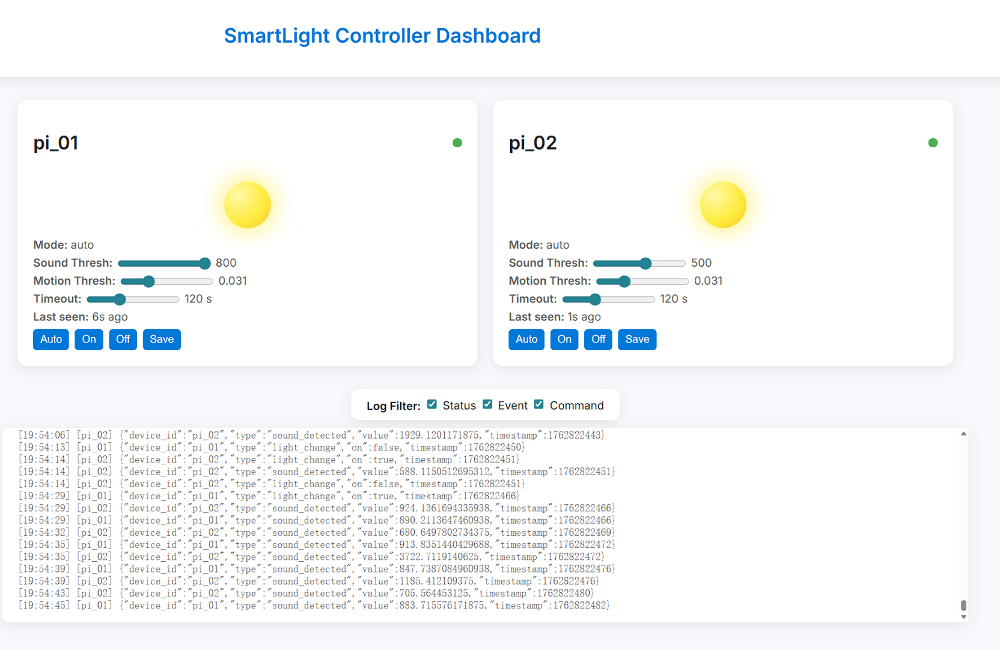
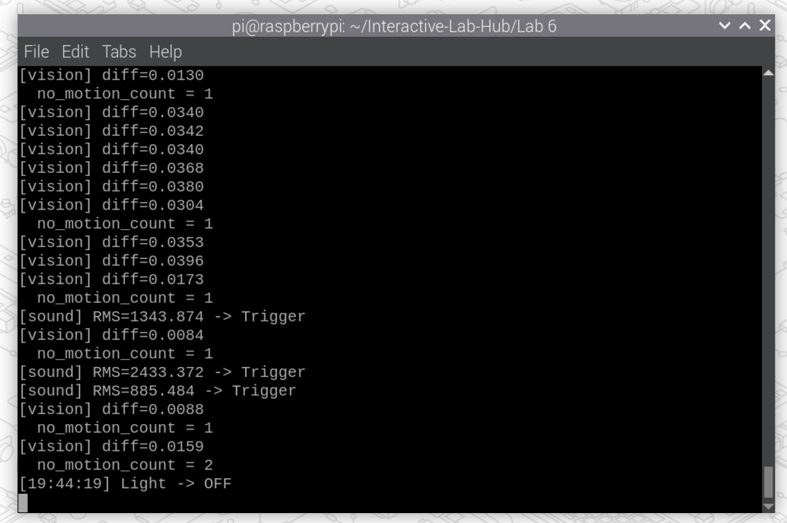

# Distributed Interaction

**Dean Xu - hx332**

**Wenzhuo Ma - wm356**


---

## Prep

1. Pull the new changes
2. Read: [The Presence Table](https://dl.acm.org/doi/10.1145/1935701.1935800) ([video](https://vimeo.com/15932020))

## Overview

Build interactive systems where **multiple devices communicate over a network** using MQTT messaging. Work in teams of 3+ with Raspberry Pis.

**Parts:**
- A: Learn MQTT messaging
- B: Try collaborative pixel grid demo  
- C: Build your own distributed system

---

## Part A: MQTT Messaging

MQTT = lightweight messaging for IoT. Publish/subscribe model with central broker.

**Concepts:**
- **Broker**: `farlab.infosci.cornell.edu:1883`
- **Topic**: Like `IDD/bedroom/temperature` (use `#` wildcard)
- **Publish/Subscribe**: Send and receive messages

**Install MQTT tools on your Pi:**
```bash
sudo apt-get update
sudo apt-get install -y mosquitto-clients
```


**Test it:**

**Subscribe to messages (listener):**
```bash
mosquitto_sub -h farlab.infosci.cornell.edu -p 1883 -t 'IDD/#' -u idd -P 'device@theFarm'
```

**Publish a message (sender):**
```bash
mosquitto_pub -h farlab.infosci.cornell.edu -p 1883 -t 'IDD/test/yourname' -m 'Hello!' -u idd -P 'device@theFarm'
```

> **💡 Tips:**
> - Replace `yourname` with your actual name in the topic
> - Use single quotes around the password: `'device@theFarm'`

**🔧 Debug Tool:** View all MQTT messages in real-time at `http://farlab.infosci.cornell.edu:5001`


**💡 Brainstorm 5 ideas for messaging between devices**
1. Distributed Classroom Emotion Wall
Each desk is equipped with a strip of LEDs and a simple input device (such as buttons or touch sensors). Students can press buttons to express their current state (e.g., ✅ “Understood,” ❓ “Confused,” 😴 “Tired”). The device broadcasts these signals via MQTT, and a central server (or display) calculates the real-time emotional heatmap of the class. The system visualizes this using a color spectrum — green for high comprehension, yellow for neutral, and red for widespread confusion.

2. Cloud-Based Ecological Co-Nurturing System
Each device is connected to a plant or environmental sensors (for light, humidity, temperature, etc.). Devices share their local environmental parameters through MQTT to compute a Collective Ecological Balance Index. When one location becomes too dry or too dark, others automatically adjust their water pumps or lighting to compensate — creating a “mutual-aid ecosystem” that dynamically maintains group equilibrium.

3. Sensory Symphony
Each device acts as a sensory instrument:

One controls sound (speaker/buzzer)

One controls light (RGB LED ring)

One controls airflow (small fan or motor)

These devices exchange sensory events through MQTT. For example, light intensity may trigger pitch changes; wind speed may control light flicker frequency; the sound spectrum may modulate wind strength. The result is a real-time, interdependent symphony of physical, visual, and auditory interactions.

4. Random Narrative Machine
Each device continuously generates short “fragmented verses” or “audio snippets” and sends them via MQTT to another randomly selected device. The receiving device remixes or rearranges the fragments into new sentences or noise patterns, then retransmits them. The messages never disappear — they keep transforming, circulating, and regenerating across the network, forming an endless web of evolving narratives.

5. Phantom Swarm
Each device drives a small mechanical module (e.g., a servo motor + LED) that simulates a “luminous insect.” Through MQTT, these modules sense their neighbors’ motion states and energy levels. When one device flashes, nearby ones react instantly with startled flickers, producing a spatially dynamic electric swarm. In a dark room, dozens of tiny lights will pulse, ripple, and echo in intricate rhythms — like a colony of breathing electronic organisms.
---

## Part B: Collaborative Pixel Grid

Each Pi = one pixel, controlled by RGB sensor, displayed in real-time grid.

**Architecture:** `Pi (sensor) → MQTT → Server → Web Browser`

**Setup:**

1. **Sensor**

#### Light/Proximity/Gesture sensor (APDS-9960)
We use this sensor [Adafruit APDS-9960](https://www.adafruit.com/product/3595) for this exmaple to detect light (also RGB)
 


Connect it to your pi with Qwiic connector


We need to use the screen to display the color detection, so we need to stop the running piscreen.service to make your screen available again

```bash
# stop the screen service
sudo systemctl stop piscreen.service
```

if you want to restart the screen service
```bash
# start the screen service
sudo systemctl start piscreen.service
```
 
2. **Server** (one person on laptop):
```bash
cd "Lab 6"  
source .venv/bin/activate
pip install -r requirements-server.txt
python app.py
```

2. **View in browser:**
   - Grid: `http://farlab.infosci.cornell.edu:5000`
   - Controller: `http://farlab.infosci.cornell.edu:5000/controller`

3. **Pi publisher** (everyone on their Pi):
```bash
# First time setup - create virtual environment
cd "Lab 6"
python -m venv .venv
source .venv/bin/activate
pip install -r requirements-pi.txt

# Run the publisher
python pixel_grid_publisher.py
```

Hold colored objects near sensor to change your pixel!


**📸 Include: Screenshot of grid + photo of your Pi setup**

<div style="display: flex; flex-wrap: wrap; gap: 10px;">


</div>

---

## Part C: Distributed Smart Light System

### 🎥 Demo Video

**[Watch the Demo Video](https://drive.google.com/file/d/1z2U-fRQ3sYxcUBsmqfmcr8pBKnpBzlK-/view?usp=drive_link)**: [https://drive.google.com/file/d/1z2U-fRQ3sYxcUBsmqfmcr8pBKnpBzlK-/view?usp=drive_link](https://drive.google.com/file/d/1z2U-fRQ3sYxcUBsmqfmcr8pBKnpBzlK-/view?usp=drive_link)

---

### Scenario: Building-Wide Smart Lighting Control

Imagine a multi-story building where each hallway and corridor is equipped with smart lighting nodes. These nodes are connected via **MQTT** (Message Queuing Telemetry Transport) protocol, enabling centralized control and intelligent response across the entire building.

**Use Case:**
- Multiple hallways across different floors can be integrated and controlled together
- Building administrators can manage all hallway lights through a central controller
- Each node operates independently but can receive remote control commands via **MQTT**
- Supports **Auto Mode** (sound + motion detection), always-on mode, and always-off mode

### Design Philosophy

**Why This Design?**

Traditional hallway lighting systems suffer from two extreme problems:

1. **Always On** - Wastes electricity, not environmentally friendly
2. **Sound-Activated but Short Duration** - Users must constantly make noise to keep lights on, which is very inconvenient

**Our Solution:**

The system uses **MQTT** as the core communication protocol to enable distributed control, with **Auto Mode** as the primary intelligent operation mode:

- **MQTT-Based Distributed Architecture** - All nodes communicate through MQTT topics, enabling seamless integration across the building
- **Auto Mode with Dual Detection** - Combines sound detection (initial trigger) and motion detection (presence maintenance) for intelligent operation
- **Smart Shutdown** - Automatically turns off when no motion is detected, saving energy
- **Centralized Management via MQTT** - Administrators can remotely adjust parameters for all nodes through MQTT commands
- **Flexible Modes** - Auto mode (default), always-on, and always-off modes to adapt to different scenarios

This design saves electricity while providing a user-friendly experience. Users don't need to constantly make noise; the system automatically detects human presence through **Auto Mode's intelligent sensing**.

---

## Quick Start

### Environment Setup

**First, set up the virtual environment and install dependencies:**

```bash
cd "Lab 6"

# Create virtual environment
python -m venv venv

# Activate virtual environment
source venv/bin/activate

# Install requirements
pip install -r requirements.txt

# Install additional dependencies
pip install sounddevice numpy==1.26.4 opencv-python==4.7.0.72 gpiozero
```

**Note:** Always activate the virtual environment before running any scripts:
```bash
source venv/bin/activate
```

### Core: MQTT Communication

**All components communicate via MQTT:**
- **Broker:** `farlab.infosci.cornell.edu:1883`
- **Credentials:** `idd` / `device@theFarm`
- **Topic Structure:**
  - Commands: `IDD/hall/smartlight/cmd/{device_id}`
  - Status: `IDD/hall/smartlight/status/{device_id}`
  - Events: `IDD/hall/smartlight/event/{device_id}`

### 1. Central Controller (lightcontroller.py)

The central controller monitors and controls all smart light nodes via **MQTT**.

**Run:**
```bash
cd "Lab 6"
source venv/bin/activate
python lightcontroller.py
```

**Features:**
- View all device statuses (received via MQTT)
- Adjust individual device parameters (sound threshold, motion threshold) via MQTT commands
- Group control (all ON / all OFF) through MQTT broadcast
- Broadcast parameters to all devices using MQTT
- Switch device modes (auto / always_on / always_off) via MQTT

**Usage Example:**
```
=== Central Controller Menu ===
1. View all device statuses
2. Adjust sound threshold for a specific device
3. Group control (all ON / all OFF)
4. Broadcast parameters (sound/motion thresholds)
5. Change device mode (auto / always_on / always_off)
q. Quit
===============================

Enter command number: 1
pi_01 -> mode=auto | light=ON | sound=500 | motion_thresh=0.031
pi_02 -> mode=auto | light=OFF | sound=500 | motion_thresh=0.031
```

**Frontend Interface:**
The central controller generates a web-based frontend interface for monitoring and controlling all devices. The interface displays real-time status of all nodes and allows remote parameter adjustment.



*Figure: Central Controller Frontend Interface (placeholder - the main program generates this frontend page)*

### 2. Smart Light Node 1 (smartlight_node_1.py)

Runs on the first Raspberry Pi with device ID `pi_01`. Operates in **Auto Mode** by default, using MQTT for communication.

**Hardware Requirements:**
- Raspberry Pi
- RGB LED (connected to GPIO17/16/26)
- Microphone (for sound detection in Auto Mode)
- Camera (for motion detection in Auto Mode)

**Run:**
```bash
cd "Lab 6"
source venv/bin/activate
python smartlight_node_1.py
```

**Auto Mode Features (Default):**
- **Sound Detection** - Monitors environmental sound, automatically turns on light when threshold is exceeded
- **Motion Detection** - Uses camera to detect motion, keeps light on while people are present
- **Auto Shutdown** - Automatically turns off after 2 frames of no motion detected
- **Timeout Protection** - Auto-shutdown after 120 seconds maximum
- **MQTT Communication** - Receives control commands via MQTT, publishes status and events

**MQTT Topics:**
- Command receive: `IDD/hall/smartlight/cmd/pi_01`
- Status publish: `IDD/hall/smartlight/status/pi_01`
- Event publish: `IDD/hall/smartlight/event/pi_01`

**Response Logs:**
The node publishes status updates and event logs via MQTT, which are displayed in the central controller interface.



*Figure: Smart Light Node Response Logs (placeholder - response logs returned to the main program via MQTT)*

### 3. Smart Light Node 2 (smartlight_node_2.py) (Same as Node 1, just different ID)

**Run:**
```bash
cd "Lab 6"
source venv/bin/activate
python smartlight_node_2.py
```

**MQTT Topics:**
- Command receive: `IDD/hall/smartlight/cmd/pi_02`
- Status publish: `IDD/hall/smartlight/status/pi_02`
- Event publish: `IDD/hall/smartlight/event/pi_02`


### System Architecture

```
┌─────────────────────┐
│  lightcontroller    │  ← Central Controller (MQTT Client)
│  (MQTT Publisher/   │     Monitors & Controls via MQTT
│   Subscriber)       │
└──────────┬──────────┘
           │
           │ MQTT Protocol
           │ (Publish/Subscribe)
           │
    ┌──────┴──────┐
    │             │
┌───▼────┐   ┌───▼────┐
│pi_01   │   │pi_02   │  ← Smart Light Nodes (MQTT Clients)
│        │   │        │     Auto Mode: Sound + Motion Detection
│Auto    │   │Auto    │     MQTT: Subscribe to commands,
│Mode    │   │Mode    │           Publish status/events
│        │   │        │
│Sound   │   │Sound   │
│Motion  │   │Motion  │
│LED     │   │LED     │
└────────┘   └────────┘
```

### Auto Mode Workflow (Default)

**Auto Mode** is the intelligent default mode that combines sound and motion detection:

1. **Sound Trigger** - When sound exceeds threshold → Light turns ON
2. **Motion Detection** - Camera detects motion → Light stays ON
3. **Auto Shutdown** - No motion detected for 10 seconds → Light turns OFF automatically
4. **Timeout Protection** - Light ON for >120 seconds → Auto-shutdown

**All state changes are published via MQTT events for monitoring.**

### Other Modes (via MQTT Commands)

- **Always-On Mode** - Light remains ON (controlled via MQTT)
- **Always-Off Mode** - Light remains OFF (controlled via MQTT)

### MQTT Debugging Tools

**Monitor MQTT Messages:**
```bash
mosquitto_sub -h farlab.infosci.cornell.edu -p 1883 -t "IDD/hall/smartlight/#" -u idd -P "device@theFarm"
```

**Online MQTT Viewer:**
- `http://farlab.infosci.cornell.edu:5001`

---

## Troubleshooting

**MQTT Connection Issues:**
- Verify Broker address: `farlab.infosci.cornell.edu:1883`
- Verify credentials: `idd` / `device@theFarm`
- Check network connectivity to MQTT broker
- Monitor MQTT messages using the debugging tools above

**LED Not Working:**
- Check GPIO connections: GPIO17=red, GPIO16=green, GPIO26=blue
- Verify LED module type (common anode/common cathode)

**Auto Mode Sound Detection Not Sensitive:**
- Adjust `sound_thresh` parameter via controller (lower value = more sensitive)
- Command sent via MQTT: `{"sound_thresh": 300}`

**Auto Mode Motion Detection Not Working:**
- Check camera connection
- Adjust `motion_thresh` parameter via MQTT (lower value = more sensitive)
- Command sent via MQTT: `{"motion_thresh": 0.02}`

**Device Not Appearing in Controller:**
- Verify device is running and connected to MQTT broker
- Wait 10 seconds for device to send status message via MQTT
- Check MQTT topic structure matches expected format
- Use MQTT subscriber to verify messages are being published

---

Resources: [MQTT Guide](https://www.hivemq.com/mqtt-essentials/) | [Paho Python](https://www.eclipse.org/paho/index.php?page=clients/python/docs/index.php)
